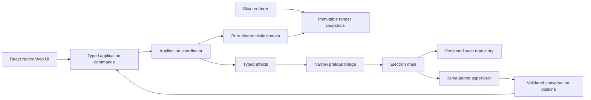

# Build SI World from specification through desktop qualification

## Overview

Build SI World as a deterministic desktop social-adventure game with an Expo/React Native Web renderer inside a secure Electron shell, build-time HFM-style character atlases, four connected neighborhoods, local Qwen conversations, validated persistent NPC knowledge, and the authored Linda vertical slice.

This plan is ordered by technical and product risk. Each phase is one focused branch and pull request. Each phase must pass its own checks, receive a Grok 4.5 `high` read-only audit, include all locally confirmed audit fixes, pass CI, merge to `main`, and synchronize locally before the next phase begins.

Implementation must not begin until Fable 5 `xhigh`, Opus 5 `xhigh`, and Grok 4.5 `high` complete the required council review of this plan and Codex applies verified corrections.

## Source of truth

- Product and system contracts: `spec.md`
- First council synthesis: `audits/2026-08-10-spec-council-audit.md`
- Plan council synthesis: `audits/2026-08-10-implementation-plan-council-audit.md`
- This implementation order: `docs/plans/2026-08-10-feat-build-si-world-vertical-slice-plan.md`
- Phase evidence: `artifacts/phase-XX/`
- Phase Grok disposition: `audits/phase-XX-grok-audit.md`
- Authoritative implementation state: merged `main`, not an open branch, browser export, or local uncommitted file

When this plan and the specification conflict, stop the phase and correct the document conflict before coding around it.

## Scope

### Included

- Strict TypeScript Expo 57 application and React Native Web renderer
- Secure Electron 43.3.x shell and Electron Forge packaging
- `app://game/` packaged protocol and CanvasKit loading
- Pure deterministic domain state, command, event, clock, PRNG, and snapshot layers
- Electron-main versioned JSON save repository with recovery and migration
- Reproducible build-time art generator and flat runtime atlases
- Click-to-move tile world, camera, collision, pathfinding, interiors, roofs, and four maps
- Time, sleep, Energy, Health, allowance, NPC schedules, and cross-map transfers
- Supervised loopback `llama-server` and fake/recorded model adapters
- Buffered, schema-constrained, filtered, validated local conversations
- NPC knowledge, false beliefs, memories, relationships, boundaries, consent, and rejection
- Factions, journal, invitations, contextual violence, evidence, police states, and defeat
- Linda's abusive-boyfriend quest with three terminal approaches
- Version-one cast and functional neighborhood population
- macOS and Windows packaging, model qualification, licences, hashes, and migration evidence

### Excluded

- Multiplayer or shared worlds
- Generated full speech
- Steam Deck certification in version one
- Usable ferry or island departure
- Full side-profile bodies unless the cheaper art fallback fails
- Sitting, romance, combat, and job activity animations in the initial slice
- Runtime skeletal characters or runtime paper-doll composition
- Background LLM planning, autonomous LLM schedules, or multiple model instances
- Steam Cloud conflict UI, store submission, public release, release-certificate acquisition, or paid infrastructure without separate evidence and authority

## Stakeholders

- **Player:** needs clear controls, stable saves, responsive dialogue, visible consequences, and understandable failure feedback.
- **Developer:** needs deterministic tests, reproducible art, narrow phase scope, recoverable data, and proof that local state matches merged remote state.
- **Platform and release:** need sandboxed Electron behavior, correct model licences, accurate AI disclosure, signed platform builds, and reproducible packaged resources.

## Research decisions

### Reuse from Life Sim

- Match the verified Expo 57, React 19.2, React Native 0.86, React Native Web 0.21, Skia 2.6.2, Reanimated 4.5, Worklets 0.10, Zod 4, and Zustand 5 stack.
- Copy the architecture pattern: pure simulation rings, injected time and PRNG, Zod content registry, versioned migrations, Node-based Jest, one `verify` command, deterministic atlas generation, and generated-asset drift checks.
- Do not copy its story, queue gameplay, home layout, SQLite/localStorage persistence, or character dimensions.

### Reuse from Hero Football Manager

- Adapt the identity source pattern from `scripts/player-art-roster.mjs`.
- Read the local HFM `src/render/sprites/loader.ts` once during Phase 4, adapt `deriveBackFacingFrame()` into SI World's own tested `scripts/art/rear-frame.ts`, and keep every build and CI task self-contained after that vendoring step.
- Reuse the test ideas for facing, foot direction, palette, silhouette, portrait/world identity, and atlas reachability.
- Do not copy football kits, the full roster, real-player references, or runtime atlas generation.

### Current official framework constraints

- Use a secure custom protocol, not `file://`, because Expo's exported assets use root-relative paths.
- Keep CanvasKit at `public/canvaskit.wasm` before export and prove it exists in `dist/` after export.
- Keep Electron renderers sandboxed with Node integration disabled and context isolation enabled.
- Keep saves, child processes, server calls, paths, and credentials in Electron main.
- Spawn `llama-server` with `shell: false`, absolute paths, loopback host, private per-run API key file, offline/no-UI mode, bounded restarts, and a circuit breaker.
- Use Zod as both the source of JSON Schema and the final validator because llama.cpp grammar support does not enforce every JSON Schema keyword.

## Architecture



### Required repository layout

```text
electron/
  main/
  preload/
  protocol/
  ipc/
  model/
  persistence/

src/
  application/
    runtime/
    snapshots/
    effects/
  domain/
    state/
    commands/
    events/
    clock/
    relationships/
    factions/
    invitations/
    journal/
    quests/
    consequences/
    economy/
  world/
    maps/
    pathfinding/
    schedules/
    transfers/
  ai/
    schemas/
    projection/
    registry/
    validation/
    policy/
    conversation/
    transport/
  content/
    schemas/
    registries/
  render/
  ui/

content/
  registries/
  characters/
  quests/
  maps/
  world/
    locations/
    factions/
    characters/

scripts/
  art/
  content/
  model/
  verification/

assets/
  source/
  generated/

tests/
  electron/
  fixtures/
  performance/
```

React, Skia, Zustand, Electron, filesystem APIs, wall-clock reads, and local-model APIs may not be imported by `src/domain/**` or pure `src/world/**` algorithms.

## Global invariants

1. One serialized command queue owns every authoritative mutation.
2. Domain functions receive time, random values, content, and commands as input. They do not call `Date.now()` or `Math.random()`.
3. Every persistent change has a stable idempotency event ID.
4. Versioned `state.json` is the only save authority. Markdown prompt views are disposable.
5. Save migrations create a new generation and never edit the source generation.
6. An NPC is in exactly one location state: active local, in transit, or inactive at a destination.
7. Pause reasons are tokens. Removing one reason cannot clear another reason.
8. Generated text appears only after complete parsing, policy classification, source validation, boundary validation, and state validation.
9. Free text can create a sourced held belief or low-impact conversational signal. High-impact effects require structured actions, observations, or authored events.
10. The model can propose commands but cannot write saves, choose arbitrary IDs, open files, call tools, or alter world truth.
11. Authored source layers and manifests are the art authority. Generated atlases are reproducible products.
12. Browser success does not prove packaged Electron, macOS, Windows, CanvasKit, save, or model behavior.
13. Model speed cannot compensate for a failed schema, state-safety, consent, or content-policy gate.
14. Existing unrelated changes in Life Sim and HFM remain untouched.

## Standard verification commands

The final scripts are added incrementally, but their stable names are:

```bash
npm run validate:content
npm run typecheck
npm test -- --runInBand
npm run art:atlas
npm run art:check
npm run export:web
npm run test:electron
npm run verify
```

Phase-specific package, model, fault-injection, and performance commands are added when their systems exist.

## Phase completion protocol

Every implementation phase follows this exact sequence. A phase's `Files` list names its primary product paths. The same phase may also change only the shared infrastructure required to build and prove those paths: `package.json`, `package-lock.json`, the affected CI workflow, its exact `audits/phase-XX-grok-audit.md`, and its exact `artifacts/phase-XX/` evidence directory. Any other path must be added to the plan before it is edited.

1. Confirm `main` matches `origin/main`, the worktree is clean, and the prior PR's merged SHA is local.
2. Create `codex/phase-XX-<slug>` from that SHA.
3. Implement only the phase's named product files, gates, and permitted shared infrastructure.
4. Run the narrow checks first, then `npm run verify`, then the required practical runtime check.
5. Run Grok 4.5 at `high` in read-only audit mode against the phase diff and its acceptance gates.
6. Re-open every Grok citation. Fix only confirmed in-scope defects and record accepted, rejected, and uncertain claims in `audits/phase-XX-grok-audit.md`.
7. Rerun all affected checks and practical verification.
8. Stage the exact phase-owned product and shared paths. Inspect the path list and staged diff. Do not use blind `git add -A`.
9. Commit with `feat:`, `fix:`, `test:`, or `chore:` scope that names the phase result.
10. Push the branch and open one pull request against `main` with checks, screenshots or logs, Grok disposition, and explicit non-goals.
11. Wait for required checks, resolve verified review comments, and squash-merge the PR.
12. Fetch, synchronize local `main`, prove its SHA equals remote `main`, and only then create the next phase branch.

A phase is not complete when it is only locally committed, statically exported, or open as a PR.

## Preflight before Phase 1

- Apply and record the required three-model council review of this plan.
- Commit the corrected specification, council artifacts, and reviewed plan.
- Create the private remote `tanglefast23/sim-intelliegence-world` unless a same-purpose remote appears first.
- Push planning `main` and set `origin/main` tracking.
- Add a default-branch ruleset that requires pull requests, current status checks, resolved conversations, and no force pushes or deletion. If the account tier cannot enforce a rule, record that limitation and use the same manual gate.
- Keep workflow permissions read-only by default and pin third-party GitHub Actions to full commit SHAs.
- Exclude local model files, binaries, logs, prompts, saves, and generated temp keys from Git.

## Council review disposition

The required Fable 5 `xhigh`, Opus 5 `xhigh`, and Grok 4.5 `high` review completed on 2026-08-10. The verified corrections in this plan are:

1. Phase 6 proves save mechanics with fixture-driven stable-boundary requests. Phases 8 and 11 prove the real sleep, travel, and quest triggers.
2. Phase 8 owns only its named `WORLD-*` gates. Phase 12 owns `WORLD-13` and reruns the complete integrated set.
3. Phase 9 does not claim relationship and rejection persistence that Phase 10 implements.
4. Shared manifests, CI, audit disposition, and evidence paths are permitted in each phase without opening unrelated scope.
5. Phase 5 owns the `content/world/` schema and minimum fixtures. Phase 13 owns complete world authorship and reachability.
6. The HFM rear-frame method becomes a self-contained SI World build-time module in Phase 4; CI never reads sibling repositories.
7. Phase 14 uses non-distribution test signing and measures the locked `100 ms` non-text feedback threshold. Release identities and notarization remain outside this prototype plan.

## Execution status

- [x] Preflight — planning commit, private remote, and default-branch controls
- [x] Phase 1 — Repository foundation
- [x] Phase 2 — Secure Electron and CanvasKit spike
- [x] Phase 3 — Local-model risk spike
- [ ] Phase 4 — Character and atlas spike
- [ ] Phase 5 — Deterministic domain contracts
- [ ] Phase 6 — Save, recovery, and migration safety
- [ ] Phase 7 — World renderer and local movement
- [ ] Phase 8 — Time, maps, schedules, needs, and economy
- [ ] Phase 9 — Validated conversation system
- [ ] Phase 10 — Relationships, factions, journal, and invitations
- [ ] Phase 11 — Consequences and Linda quest
- [ ] Phase 12 — Integrated first-hour vertical slice
- [ ] Phase 13 — Cast and neighborhood production
- [ ] Phase 14 — Desktop and model qualification

## Phase 1 — Repository foundation

**Branch:** `codex/phase-01-foundation`
**PR title:** `feat: establish SI World deterministic workspace`

### Files

- `package.json`, `package-lock.json`, `app.json`, `tsconfig.json`, `jest.config.js`
- `App.tsx`, `index.ts`
- `.gitignore`, `.github/workflows/ci.yml`
- `src/domain/prng.ts`, `src/domain/version.ts`
- `src/domain/__tests__/prng.test.ts`, `src/domain/__tests__/architecture.test.ts`
- `scripts/verification/check-import-boundaries.ts`

### Work

- Pin the verified Life Sim-compatible dependency versions and Node `>=22.13`.
- Enable strict TypeScript, `noUncheckedIndexedAccess`, and `noFallthroughCasesInSwitch`.
- Add Jest in a Node environment for pure rings.
- Add one saved-state PRNG with deterministic tests.
- Add an import-boundary check that rejects platform dependencies from pure modules.
- Add `validate:content`, `typecheck`, `test`, `export:web`, and `verify` scripts with safe placeholders only where a later phase owns implementation.
- Add pinned CI actions and clean-install verification.

### Gates

- `npm ci`, typecheck, tests, and web export pass from a clean checkout.
- Two identical seeded runs produce byte-identical PRNG output.
- An intentionally forbidden platform import makes the architecture test fail.
- CI runs on the branch and reports the exact tested SHA.

### Grok audit focus

Dependency compatibility, false placeholder success, deterministic boundaries, CI permissions, and reproducibility.

## Phase 2 — Secure Electron and CanvasKit spike

**Branch:** `codex/phase-02-electron-shell`
**PR title:** `feat: add secure packaged Electron shell`

### Files

- `forge.config.ts`, `electron/tsconfig.json`
- `electron/main/index.ts`, `electron/preload/index.ts`
- `electron/protocol/app-protocol.ts`, `electron/ipc/contracts.ts`
- `src/application/LoadingShell.tsx`, `src/application/DesktopBridge.ts`
- `public/canvaskit.wasm`, CSP configuration
- `tests/electron/security.test.ts`, `tests/electron/package-smoke.test.ts`

### Work

- Add Electron `43.3.x` and Electron Forge.
- Compile Electron main and preload separately from the Expo web export.
- Register standard secure `app://game/` before ready and map it to `dist/` after traversal-safe resolution.
- Load Expo JavaScript, fonts, audio, images, and CanvasKit without a development server or network.
- Set every locked BrowserWindow security option explicitly.
- Add exact-origin navigation and window denial, permission denial, restrictive CSP, and sender validation.
- Expose only version/status test methods through typed asynchronous preload IPC.
- Display an authored loading/failure shell before Skia is ready.

### Gates

- `SHELL-01`, `SHELL-02`, `SHELL-03`, and `SHELL-05` pass.
- Packaged macOS development build starts offline and renders a Skia proof canvas.
- Traversal, arbitrary IPC, unexpected navigation, new-window, and Node-global probes fail safely.
- Browser export is recorded separately and is not used as package proof.

### Grok audit focus

Electron attack surface, protocol traversal, CSP, IPC exposure, package-resource paths, and false-positive smoke tests.

## Phase 3 — Local-model risk spike

**Branch:** `codex/phase-03-local-model`
**PR title:** `feat: supervise local Qwen runtime`

### Files

- `electron/model/model-supervisor.ts`, `electron/model/model-client.ts`
- `electron/model/model-manifest.ts`, `electron/model/port.ts`
- `src/ai/transport/InferenceAdapter.ts`, `src/ai/transport/FakeInferenceAdapter.ts`
- `src/ai/schemas/spike-response.ts`
- `scripts/model/build-llama.ts`, `scripts/model/prepare-model.ts`, `scripts/model/hash-manifest.ts`
- `model-manifest.example.json`
- `tests/electron/model-lifecycle.test.ts`, `tests/fixtures/model/*.json`

### Work

- Pin a llama.cpp revision containing Qwen3.5 support and the long-input tokenizer fix.
- Reproducibly build platform binaries and keep real binaries/GGUFs outside Git.
- Convert or approve pinned Qwen3.5-9B and Qwen3.5-4B `Q4_K_M` artifacts with hashes and licences.
- Spawn with absolute paths, `shell: false`, loopback, random port, private API key file, offline/no-UI mode, context `8192`, parallel `1`, reasoning off, and no multimodal projector.
- Keep URL, key, logs, and HTTP calls in main.
- Implement health loading/ready states, `120`-second deadline, one queue, two bounded restarts per five minutes, circuit breaker, graceful shutdown, and forced-stop fallback.
- Generate a flat JSON Schema from Zod and revalidate returned JSON with Zod.
- Run a reduced valid/invalid/duplicate/truncated/hostile response corpus with both fake and real adapters.

### Gates

- `SHELL-04` passes on current development hardware.
- One real constrained Qwen response validates; an invalid response retries once then returns authored no-change fallback.
- Kill/restart/quit tests leave no known child, port, or model memory leak.
- Model files are absent from Git and the manifest contains revision, conversion, licences, sizes, and SHA-256 hashes.
- Record early 9B and 4B results as risk evidence only; do not claim named-baseline qualification.

### Grok audit focus

Process leaks, secret exposure, command injection, restart storms, unbounded logs, model provenance, schema assumptions, and fake-adapter drift.

## Phase 4 — Character and atlas spike

**Branch:** `codex/phase-04-character-atlas`
**PR title:** `feat: generate SI World character atlases`

### Files

- `scripts/art/character-source.ts`, `scripts/art/build-world-atlas.ts`
- `scripts/art/build-portrait-atlas.ts`, `scripts/art/build-review-sheet.ts`
- `scripts/art/rear-frame.ts`, `scripts/art/lateral-legs.ts`
- `assets/source/characters/*.json`, `assets/source/tiles/*.json`
- `assets/generated/world-atlas.png`, `assets/generated/atlas-index.json`
- `src/render/AtlasProof.tsx`, `src/render/atlas.ts`
- `scripts/art/__tests__/*.test.ts`, `src/render/__tests__/atlas-bill.test.ts`

### Work

- Create original protagonist, Linda, and generic-resident identities using HFM's source-data grammar.
- Keep legs, torso/clothing, head/face, hair, accessory, and held item as source layers.
- Author two front walk frames and two lateral leg shapes per required outfit.
- Move the rear-frame derivation into build time and export eight flat world cells.
- Generate HFM-style portraits and `8–12` original environment tiles.
- Build one deterministic RGBA PNG atlas with one-pixel gutters and rectangle index.
- Render with one Skia Atlas, nearest-neighbor sampling, integer scale, and snapped positions.
- Generate review sheets and reverse bill-of-materials reachability tests.

### Gates

- Every `ART-*` gate passes in the packaged Electron scene at native `1×`, `2×`, and `3×`.
- Regeneration is byte-identical and `git diff --exit-code -- assets/generated` stays clean.
- Palette, outline, silhouette, feet, rear-facing, portrait identity, and reachability tests pass.
- Horizontal motion is accepted with the cheap cells or the mirrored three-quarter head fallback is implemented and recorded before cast production.

### Grok audit focus

Unreachable generated cells, runtime composition leakage, identity drift, lateral readability, indexed PNG use, atlas bleed, and accidental HFM content copying.

## Phase 5 — Deterministic domain contracts

**Branch:** `codex/phase-05-domain-core`
**PR title:** `feat: add authoritative deterministic domain`

### Files

- `src/domain/state/*`, `src/domain/commands/*`, `src/domain/events/*`
- `src/domain/clock/*`, `src/domain/relationships/*`, `src/domain/economy/*`
- `src/content/schemas/*`, `src/content/registries/*`
- `content/registries/*.json`, `content/characters/*/rules.json`
- Minimum `content/world/{setting.md,history.md,social-rules.md,locations/*.json,factions/*.json,characters/*.json}` fixtures
- `scripts/content/validate-content.ts`
- `src/domain/__tests__/*`, `tests/fixtures/domain/*`

### Work

- Define the versioned serializable state envelope and stable entity IDs.
- Implement the single command queue, immutable reducer, event ledger, stable tie-breaking, and pause tokens.
- Define protagonist, NPC, relationship, faction, inventory, economy, quest, journal, map, schedule, transfer, evidence, and police-state schemas without implementing all behaviors yet.
- Implement the clock math, value clamps, relationship delta bounds, stage floors, faction delta bounds, and idempotency receipts.
- Build all global registries and NPC `rules.json` validation with cross-file reference checks.
- Validate the locked `content/world/` layout and its stable references. Add minimum fixtures now; complete authored world content remains Phase 13 work.
- Generate disposable prompt views from state for snapshot tests.

### Gates

- Identical initial state plus command stream yields byte-identical state and event ledger.
- Duplicate event IDs are no-ops.
- Pause-token tests prove one token cannot resume another.
- Invalid, missing, duplicate, and cross-file content IDs fail the build.
- Generated Markdown deletion and regeneration never changes state.

### Grok audit focus

Hidden nondeterminism, mutable aliases, version omissions, enum gaps, idempotency, integer bounds, and prose becoming authority.

## Phase 6 — Save, recovery, and migration safety

**Branch:** `codex/phase-06-save-safety`
**PR title:** `feat: add recoverable versioned saves`

### Files

- `electron/persistence/save-repository.ts`, `electron/persistence/write-queue.ts`
- `electron/persistence/recovery.ts`, `electron/persistence/checksum.ts`
- `src/application/effects/PersistencePort.ts`
- `src/domain/state/migrations/*.ts`
- `tests/electron/save-faults.test.ts`, `tests/fixtures/saves/*`

### Work

- Store under `app.getPath('userData')/si-world` through main-process IPC only.
- Serialize all writes and reject stale generation IDs.
- Write, flush, close, reread, validate, checksum, retain recovery data, and perform same-volume replacement.
- Maintain exactly three rotating autosave generations plus manual slots and internal recovery candidates.
- On boot, select the highest complete valid generation and preserve corrupt/unknown candidates.
- Store every PRNG cursor, pending stable transfer, clock, event receipt, and pinned engine/content/prompt/model version.
- Implement copy-on-migrate and old-version fixtures.
- Accept typed fixture-driven stable-boundary save requests and defer requests while a conversation or transition token is active.
- Keep each save slot as a self-contained file tree with no process-local lock-in so later Steam Cloud file synchronization is possible; conflict UI remains out of scope.

### Gates

- Clean save/load restores byte-identical authoritative state and PRNG cursors with zero offline catch-up. Phase 7 proves the matching first rendered frame.
- Fault injection after each persistence step, disk-full, permission, corruption, stale writer, and process kill preserves or recovers the newest complete generation.
- An unavailable migration fails safely without modifying its source.
- Fixture-driven sleep, travel, and quest boundary requests rotate exactly three autosaves only after a stable commit. Phases 8 and 11 prove the corresponding real triggers.

### Grok audit focus

Data loss, partial replacement, stale writers, path traversal, source overwrite, checksum misuse, missing PRNG state, and platform-specific rename assumptions.

## Phase 7 — World renderer and local movement

**Branch:** `codex/phase-07-world-movement`
**PR title:** `feat: add tile world movement and villa interior`

### Files

- `src/world/maps/*`, `src/world/pathfinding/*`
- `src/render/WorldScene.tsx`, `src/render/camera.ts`, `src/render/depth.ts`
- `src/ui/WorldInput.tsx`, `src/application/runtime/world-runtime.ts`
- `content/maps/northwest.json`
- `src/world/__tests__/*`, `src/render/__tests__/*`

### Work

- Validate `64×48` map layers, portals, doors, roof groups, collision, interactions, and staging tiles.
- Implement deterministic four-direction A* with stable tie-breaking.
- Resolve click priority across UI, NPC, object, interaction, and floor targets.
- Support movement interruption, path cancellation, moving blockers, and visible unreachable feedback.
- Implement middle drag, optional edge pan, wheel zoom, `F` center, integer pointer transforms, and bounds.
- Render floors, props, characters, shadows, effects, walls, and roofs in explicit depth order.
- Build the villa's five readable areas, pathfindable door, and roof restore behavior.

### Gates

- `WORLD-02`, `WORLD-03`, and `WORLD-04` pass in packaged Electron.
- Golden path tests cover equal-cost ties, blocked targets, interruption, and moving blockers.
- Entering, saving inside, reloading, and leaving the villa reconstructs the correct roof.
- Reloading the same authoritative snapshot produces the same first rendered world frame.
- Player-visible input and camera behavior is verified at all three zoom levels.

### Grok audit focus

Coordinate errors, click-through UI, nondeterministic A*, diagonal shortcuts, depth order, roof state, unreachable feedback, and high-frequency React commits.

## Phase 8 — Time, maps, schedules, needs, and economy

**Branch:** `codex/phase-08-world-simulation`
**PR title:** `feat: simulate neighborhoods schedules and needs`

### Files

- `src/world/schedules/*`, `src/world/transfers/*`
- `src/domain/clock/sleep.ts`, `src/domain/economy/*`
- `src/application/runtime/tick.ts`, `src/application/runtime/transitions.ts`
- `src/ui/Hud.tsx`, `src/ui/BedActions.tsx`
- `content/maps/{northeast,southwest,southeast}.json`
- `content/economy/prototype.json`, schedule fixtures and tests

### Work

- Implement pause, `1×`, `2×`, authoritative minute ticks, and stable large-time-jump processing.
- Add nap, overnight sleep, Energy, Health, allowance, costs, ordinary reward, and dangerous reward.
- Add four to six daily schedule blocks and active/inactive movement.
- Implement NPC local/in-transit/inactive ownership and cross-neighborhood transfer records.
- Implement four map transitions with rollback to source position after failed load.
- Add the visible unusable ferry.
- Trigger sleep and travel autosaves only after all effects complete.

### Gates

- `WORLD-01`, `WORLD-05` through `WORLD-10`, and `WORLD-14` pass. `WORLD-11` passes for real sleep and travel triggers; Phase 11 adds the real quest trigger, and Phase 12 reruns the complete `WORLD-*` set.
- Large time jumps process equal timestamps in stable priority and entity-ID order.
- NPC transfer never duplicates, disappears, or teleports after transition, sleep, save, or reload.
- Blocked destination entrances use the deterministic staging tile and visible feedback.
- Allowance and quest-reward ratios pass exact fixtures.

### Grok audit focus

Double ticks, pause leaks, schedule ordering, transfer ownership, transition rollback, autosave timing, value drift, and inactive-world over-simulation.

## Phase 9 — Validated conversation system

**Branch:** `codex/phase-09-conversations`
**PR title:** `feat: add safe persistent local conversations`

### Files

- `src/ai/schemas/*`, `src/ai/projection/*`, `src/ai/registry/*`
- `src/ai/validation/*`, `src/ai/policy/*`, `src/ai/conversation/*`
- `src/ui/ConversationPanel.tsx`, `src/application/effects/InferencePort.ts`
- `content/characters/{linda,generic-resident}/*`
- `tests/fixtures/ai/second-named-npc/*`
- `tests/fixtures/ai/*`, `src/ai/__tests__/*`

### Work

- Build the `4,096`-token prompt projection and deterministic priority trimming.
- Generate a flat, closed response schema and revalidate every output with Zod.
- Add scene-specific fact, interest, action, memory, unlock, quest, location, and faction candidate registries.
- Validate player-message evidence, scene observations, reports, authored events, hard boundaries, and idempotency.
- Separate world truth, observed fact, and sourced held belief.
- Add one correction retry and authored no-change fallback.
- Add layered content policy: policy prompt, deterministic high-confidence blocker, same-model closed-enum safety classification, and fail-closed invalid-classifier behavior.
- Buffer the full generation and classification before a type-on reveal.
- Stage accepted proposals inside one conversation transaction and commit atomically only on clean conversation end.
- Discard staged state on cancel, timeout, crash, forced close, or renderer loss.
- Keep authored exploration and ambient dialogue available after the model circuit breaker opens.
- Use a minimal second named-NPC knowledge fixture to prove that Linda-only information does not leak. Do not add the production cast before Phase 13.

### Gates

- `AI-01` through `AI-09`, `AI-10A`, and `AI-11` through `AI-14` pass with fake, recorded, and real model adapters. Phase 10 owns the remaining `AI-10` relationship and rejection persistence, and Phase 12 reruns the complete `AI-*` set.
- Valid, invalid, hostile, duplicate, delayed, truncated, refusal, false-belief, and crash fixtures pass.
- No rejected generated text appears in the UI or logs.
- No free-text claim directly grants a high-impact effect.
- Conversation pause tokens and atomic commit/discard behavior survive reload tests.

### Grok audit focus

Prompt injection, schema bypass, semantic overclaim, policy false negatives, partial display, partial commit, memory leaks, incorrect knowledge projection, and model/main-renderer boundary violations.

## Phase 10 — Relationships, factions, journal, and invitations

**Branch:** `codex/phase-10-social-systems`
**PR title:** `feat: add social progression and invitations`

### Files

- `src/domain/relationships/*`, `src/domain/quests/journal.ts`
- `src/domain/factions/*`, `src/domain/invitations/*`
- `src/ui/JournalPanel.tsx`, `src/ui/RelationshipPanel.tsx`
- `content/registries/factions.json`, social fixtures and tests

### Work

- Implement integer relationship values, event delta limits, stage floors, stricter NPC rules, eligibility, and consent.
- Implement permanent and changeable rejection records.
- Implement two prototype factions, standing tiers, hidden discovery, idempotent deltas, and access gates.
- Implement vague leads, exact-location markers, deadlines, states, and outcome receipts.
- Implement invitation accept/reject/counter-schedule, conflict validation, travel reservation, cancellation, and replan feedback.
- Connect structured social actions to the conversation transaction without model-owned state.

### Gates

- `AI-10` passes for relationship values, stages, beliefs, knowledge, rejection records, and major memory subjects. Relationship, consent, and rejection branches of `AI-11` pass.
- `QUEST-03` through `QUEST-07` and `QUEST-11` pass against named social fixtures. Phase 11 reruns them with Linda's final quest content.
- High values cannot bypass compatibility, hard boundaries, unresolved circumstances, or consent.
- Repeated dialogue cannot duplicate relationship, faction, journal, or invitation effects.
- A cross-map accepted invitation uses the transfer system and never teleports.

### Grok audit focus

Consent bypass, score-only stage changes, repeat rewards, hidden-faction leaks, marker over-disclosure, schedule conflicts, and invitation teleportation.

## Phase 11 — Consequences and Linda quest

**Branch:** `codex/phase-11-linda-quest`
**PR title:** `feat: add Linda quest and criminal consequences`

### Files

- `src/domain/quests/quest-machine.ts`, `src/domain/consequences/*`
- `content/quests/linda-boyfriend.json`
- `content/characters/linda/*`, `content/characters/linda-boyfriend/*`
- `src/ui/ContextActionMenu.tsx`, quest and consequence fixtures/tests

### Work

- Author the protect-Linda, betray-for-advantage, and withdraw terminal approaches.
- Keep objectives, checks, rewards, relationship deltas, faction deltas, and follow-up leads in structured content.
- Add contextual action validation using position, equipment, Health, preparation, witnesses, and quest state.
- Add evidence, witnessed crime, four police-attention states, arrest hooks, and NPC-death permission checks.
- Add the `injured_escape` package with exact Health/time cost and no permanent protagonist death.
- Apply each terminal outcome as one idempotent transaction, then trigger the quest autosave.

### Gates

- Every `QUEST-*` gate passes.
- The real quest-outcome portion of `WORLD-11` passes only after the terminal transaction completes.
- Each terminal approach has a clear player cause, result, social consequence, and practical or route consequence.
- Repeating or reloading a terminal event cannot duplicate payment, standing, injury, evidence, or journal changes.
- Violence uses the existing abstract cells and adds no combat activity animation.

### Grok audit focus

Quest dead ends, unclear choice consequences, duplicate outcomes, abusive-relationship handling, accidental coercion framing, evidence/witness errors, defeat loops, and generated-state authority.

## Phase 12 — Integrated first-hour vertical slice

**Branch:** `codex/phase-12-first-hour`
**PR title:** `feat: deliver SI World first-hour vertical slice`

### Files

- `src/application/NewGameFlow.tsx`, `src/application/GameScreen.tsx`
- `src/ui/*` integration and accessibility tests
- final prototype content, audio cues, tutorial-free opening, and end-to-end scripts
- `artifacts/phase-12/` runtime evidence

### Work

- Add player name entry, stable internal ID, villa start, allowance receipt, Linda introduction, quest flow, and follow-up underworld lead.
- Add immediate AI loading/failure feedback and authored fallbacks.
- Add short authored laughs, sighs, greetings, and consequence cues.
- Verify ordinary resident schedules, visible needs, journal, faction reveal, invitation, save/load, and neighborhood travel in one coherent playthrough.
- Add keyboard accessibility for required buttons, focus visibility, readable text scale, reduced motion, and captions for vocal sounds.
- Record a deterministic scripted first-hour golden and a real packaged walkthrough.

### Gates

- `WORLD-13` passes, then all SHELL, ART, WORLD, AI, and QUEST gates pass together.
- A fresh start and a loaded save reach the same expected state at matched checkpoints.
- The player can continue deterministic exploration with authored dialogue when local AI is unavailable.
- The practical walkthrough proves visible cause and effect for one good, one bad, and one withdrawn quest choice.

### Grok audit focus

Integration-only regressions, invisible consequences, onboarding blocks, focus/accessibility, model-failure recovery, first-hour pacing, and save/resume truth.

## Phase 13 — Cast and neighborhood production

**Branch:** `codex/phase-13-content-scale`
**PR title:** `feat: populate SI World version-one cast`

### Files

- `content/characters/**`, `content/maps/**`, `content/quests/**`
- `content/world/**`
- `assets/source/characters/**`, regenerated atlases and indexes
- content bills, schedule fixtures, knowledge-isolation fixtures, performance fixtures

### Work

- Expand to `8–12` full-AI named NPCs and `20–40` deterministic ambient residents.
- Give every named NPC personality, biography, structured rules, schedule, knowledge, boundaries, and portrait.
- Keep every ambient resident free of model calls and persistent conversation memory.
- Populate the northwest neighborhood fully and keep the other three functionally navigable until their own authored content is accepted.
- Complete the setting, history, social rules, location, faction, and character world files used by deterministic knowledge projection.
- Add content bills for IDs, schedules, routes, atlas cells, portraits, interactions, and accessible locations.
- Add knowledge-isolation and prompt-budget tests across the full named cast.

### Gates

- All content and generated-art checks pass without drift.
- Every authored NPC, cell, portrait, quest, faction gate, schedule block, and map entrance is reachable in at least one test or runtime route.
- Worst-case prompt projection stays within `4,096` tokens.
- Active and inactive cast simulation stays within the integrated renderer budget before final qualification.

### Grok audit focus

Content-reference gaps, inaccessible NPCs, duplicated identities, boundary omissions, prompt growth, accidental ambient model calls, and cast-scale performance regressions.

## Phase 14 — Desktop and model qualification

**Branch:** `codex/phase-14-qualification`
**PR title:** `feat: qualify SI World desktop and local model`

### Files

- `tests/performance/*`, `tests/fixtures/ai-capability/*`
- platform Forge configuration and resource manifests
- `docs/release/model-provenance.md`, `docs/release/ai-guardrails.md`
- `docs/release/save-compatibility.md`, licence and notice files
- `artifacts/phase-14/{macos,windows,model,save,signing}/`

### Work

- Build and smoke macOS ARM64, macOS x64, and Windows x64 resources.
- Apply macOS ad-hoc code signing and a local self-signed Windows test certificate to non-distribution artifacts. Verify signatures and record certificate fingerprints without committing private keys. Release signing and notarization are separate future work.
- Run the full renderer and both model candidates on the named `16 GB` macOS and Windows baselines.
- Measure cold load, non-text response feedback within `100 ms`, first token, validated visible response p95, sustained tokens per second, peak memory, renderer FPS, crash recovery, and shutdown.
- Run at least 100 warm performance requests and the complete 100-fixture capability suite.
- Select 9B or 4B only when every speed, schema, state-safety, consent, and content gate passes.
- Pin official source revision, conversion, llama.cpp revision, platform binaries, GGUF, licences, notices, and SHA-256 hashes.
- Verify one compatible save migration and one unavailable-migration failure.
- Produce accurate Steam live-generated-AI and guardrail documentation without submitting the game.

### Gates

- Every `SHIP-*` gate passes with current artifacts.
- `SHIP-01` evidence uses the defined ad-hoc macOS and self-signed Windows test artifacts; it does not claim release trust or notarization.
- The selected model is the same artifact packaged and measured on both platforms, or platform-specific artifacts are explicitly versioned and migration-compatible.
- Required platform evidence comes from the named hardware. Current high-end development hardware cannot substitute for it.
- If neither model passes, the phase remains failed and does not weaken thresholds or claim completion.

### Grok audit focus

Benchmark validity, warm/cold confusion, hardware provenance, hidden network use, artefact/hash mismatch, licence gaps, packaging leaks, old-save behavior drift, and unsupported release claims.

## Test strategy

### Pure unit and property tests

- State reducers, PRNG, clocks, pauses, schedules, transfers, pathfinding, relationships, factions, quests, consequences, registries, projections, and validators
- Stable ordering and idempotency under repeated, reordered, delayed, and duplicate inputs
- Schema and boundary tests for all authored and generated data

### Golden fixtures

- Byte-identical command replays
- Old save versions and migrations
- Conversation valid/invalid/hostile/truncated outputs
- First-hour branch checkpoints
- Art atlas and bill-of-materials manifests

### Fault injection

- Save interruption at every write step
- Disk full, permission denied, stale writer, corrupt generation, and unsupported version
- Model slow load, 503, invalid JSON, timeout, crash, restart exhaustion, and app shutdown
- Map load failure, blocked portal, interrupted transition, and schedule conflicts

### Practical verification

- Browser export for fast renderer inspection
- Packaged Electron macOS smoke every phase after Phase 2
- Windows package smoke when the phase changes platform-owned code and always in Phase 14
- Real pixel review at native `1×`
- First-hour walkthrough with visible state effects
- Baseline hardware performance and memory capture

## Security and privacy checks

- No credential, model API key, prompt, dialogue, save, or private path in source control or logs
- No renderer Node access or arbitrary IPC
- No model-server address or key in renderer state
- No navigation, window, permission, or external URL without allowlist
- No network dependency for core AI gameplay
- No displayed generated text before policy and state validation
- No prohibited content stored in persistent memory after a blocked response
- No direct generated write to authoritative state

## Dependencies and prerequisites

- Node.js `22.13+`, npm, Expo 57 toolchain, platform build tools
- Current compatible Electron 43.3.x patch and Electron Forge
- Pinned llama.cpp source and build toolchain for macOS ARM64/x64 and Windows x64
- Official Qwen3.5-9B and Qwen3.5-4B source checkpoints for approved conversion
- Read-only access during Phase 4 to `/Users/joemacprom5/Documents/Vibecode/Hero_Football_Manager` and `/Users/joemacprom5/Documents/Vibecode/Life Sim`; all adapted logic is then vendored and CI has no sibling-repository dependency
- Access to the named `16 GB` macOS and Windows baseline hardware before Phase 14 can pass
- Platform tools for macOS ad-hoc signing and a temporary local self-signed Windows test certificate before Phase 14; release certificates and notarization identities are not prerequisites
- GitHub authentication for `tanglefast23` and repository/ruleset permissions

## Risks and mitigations

| Risk | Mitigation |
|---|---|
| CanvasKit fails in packaged Electron | Phase 2 custom-protocol and offline package gate before game systems |
| Qwen3.5 or llama.cpp artifact is incompatible | Phase 3 real-model spike, pinned conversion, fake adapter boundary, 4B fallback |
| Local AI is too slow during rendering | Early measurements, final integrated baselines, one request, bounded prompts, 60 FPS gate |
| Content filter misses prohibited output | Full buffering, layered checks, fail-closed classifier, adversarial fixtures, no raw streaming |
| Free text changes authoritative facts | Low-authority beliefs only; high-impact structured actions and authored events |
| Save corruption or behavior drift | Serialized flushed writes, recovery generations, checksums, migrations, model/prompt/content pins |
| Cross-map NPC duplication | Exclusive location-state union and idempotent transfer records |
| Art cost grows too early | Three-character native-zoom spike and three-quarter fallback before cast production |
| Scope contamination from sibling projects | Read-only references; implement native SI World modules; stage exact paths |
| Phase PRs stack on unmerged work | Merge and synchronize each phase before branching the next |
| Baseline hardware is unavailable | Do not fabricate proof; Phase 14 stays incomplete until exact evidence exists |

## Alternative approaches rejected

- **Ollama dependency:** rejected because players must not install a separate runtime.
- **Renderer-to-server HTTP:** rejected because it exposes server details and broadens the renderer attack surface.
- **Raw streamed model tokens:** rejected because validation and content policy occur before display.
- **Runtime layered characters:** rejected because flat build-time atlases are simpler and cheaper per frame.
- **SQLite as initial authority:** rejected because versioned JSON is inspectable and locked by the specification.
- **One giant implementation PR:** rejected because it prevents phase-level Grok review, focused evidence, and safe rollback.
- **Building the full cast before art and model spikes:** rejected because both high-cost assumptions must pass first.

## Documentation outputs

- Architecture and module-boundary guide
- Content-schema and stable-ID authoring guide
- Art-layer, atlas, and review-sheet guide
- Save format, migration, and recovery guide
- Model build, provenance, and hash guide
- AI prompt, output, validation, and content-policy guide
- Performance corpus and baseline procedure
- Phase evidence and Grok audit disposition for every PR
- Accurate Steam AI disclosure draft

## Definition of done

The plan is complete only when all 14 phase PRs are merged, every earlier gate still passes on final `main`, every phase has a Grok audit and disposition, the first-hour slice works in packaged macOS and Windows builds, the selected local model passes capability and performance on both named baselines, saves recover and migrate safely, generated art is reproducible and reachable, and the final local and remote `main` SHAs match.

An open PR, a browser build, a high-end development benchmark, or passing unit tests alone does not satisfy this definition.

## References

### Internal

- `spec.md`
- `audits/2026-08-10-spec-council-audit.md`
- Life Sim `package.json`, `src/application/loop.ts`, `src/sim/content.ts`, `scripts/art/build-atlas.ts`, and `src/render/WorldScene.tsx`
- HFM `scripts/player-art-roster.mjs`, `scripts/generate-sprites.mjs`, `scripts/generate-portraits.mjs`, and `src/render/sprites/loader.ts`

### Official external

- [Electron security](https://www.electronjs.org/docs/latest/tutorial/security)
- [Electron protocol API](https://www.electronjs.org/docs/latest/api/protocol)
- [Electron Forge packaging](https://www.electronjs.org/docs/latest/tutorial/tutorial-packaging)
- [Electron breaking changes](https://www.electronjs.org/docs/latest/breaking-changes)
- [Expo web export](https://docs.expo.dev/guides/publishing-websites/)
- [React Native Skia web setup](https://shopify.github.io/react-native-skia/docs/getting-started/web/)
- [Reanimated compatibility](https://docs.swmansion.com/react-native-reanimated/docs/guides/compatibility/)
- [llama-server documentation](https://github.com/ggml-org/llama.cpp/blob/master/tools/server/README.md)
- [llama.cpp grammar documentation](https://github.com/ggml-org/llama.cpp/blob/master/grammars/README.md)
- [Zod JSON Schema](https://zod.dev/json-schema)
- [Qwen3.5-9B](https://huggingface.co/Qwen/Qwen3.5-9B)
- [Qwen3.5-4B](https://huggingface.co/Qwen/Qwen3.5-4B)
- [GitHub protected branches](https://docs.github.com/en/repositories/configuring-branches-and-merges-in-your-repository/managing-protected-branches/about-protected-branches)
