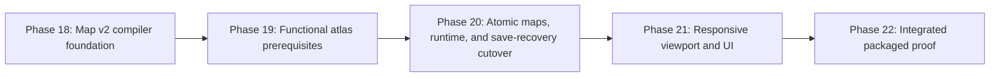
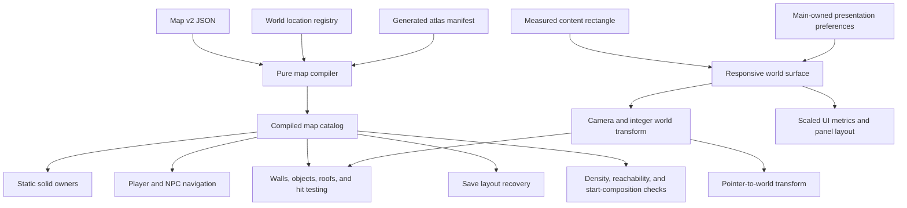

# Implement readable solid worlds and responsive desktop presentation

## 1. Outcome

Make Halcyra compact, solid, readable, and usable at common desktop sizes without changing the locked `32×32` tile, `24×30` character, four-neighborhood, or deterministic-simulation contracts.

The finished work must:

- replace map collision rectangles and one-cell props with authoritative map v2 walls, doors, objects, interaction approaches, location bindings, density profiles, and layout revisions;
- stop the player and NPCs from crossing walls and solid objects;
- make Sunward Villas read as a furnished neighborhood and make the other three districts safe structural placeholders;
- recover supported v5 saves deterministically when layout changes make stored tiles invalid;
- fill the Electron content area with a measured responsive world surface;
- keep world zoom separate from UI scale and persist both as local presentation preferences;
- pass browser, packaged Electron, macOS Intel, and Windows x64 checks;
- finish every implementation slice with a Grok `high` audit, a focused pull request, green CI, a squash merge, and exact local/remote SHA proof.

## 2. Source of truth

Use these documents in this order:

1. Product and engineering contract: `docs/specs/2026-08-10-world-readability-collision-responsive.md`
2. Scale and density measurements: `docs/measurements/2026-08-10-rimworld-scale-density.md`
3. Opus 5 and Grok specification review: `audits/phase-16-opus5-grok-review.md`
4. This implementation order: `docs/plans/2026-08-10-feat-world-readability-responsive-collision-plan.md`
5. Phase audit records: `audits/phase-18-grok-audit.md` through `audits/phase-22-grok-audit.md`
6. Phase evidence: `artifacts/phase-18/` through `artifacts/phase-22/`
7. Authoritative implementation state: merged `main`

If code and the specification conflict, stop the affected slice and correct the conflict. Do not code around it.

## 3. Scope boundary

### Included

- Map schema v2 and one compiled static-solid authority
- Modular functional wall, open-door, furniture, fixture, sign, plant, and landmark art required by map geometry
- Transparent multi-tile object parts in the generated world atlas
- Wall adjacency variants generated from modular source art
- Sunward Villas full readability pass
- Neon Crescent, Palm Exchange, and Harbor Authority structural passes
- Player and NPC collision, solid hit testing, approach-cell routing, portals, schedules, and roof regression work
- State schema v6, layout revisions, deterministic recovery, and migration evidence
- Legacy v5 save-envelope checksum and migration support
- Responsive world surface, camera resize, automatic world zoom, UI scale, and local presentation preferences
- Responsive and high-DPI packaged evidence

### Excluded

- Broad landscape texture, lighting, terrain blending, material, palette, character-style, or animation redesign
- Final art polish for all four districts
- Fractional world zoom
- Map-size changes
- Building editor, destructible objects, or dynamic construction
- Closed-door gameplay beyond the data and collision contract
- Sitting, combat, romance, or job animations
- Runtime paper-doll character composition

Phase 19 supplies functional art cells. Phase 20 uses them to prove geometry. Neither phase must pre-empt the separate art-quality program that follows Phase 22.

## 4. Delivery strategy

Do not combine this work into one pull request. Use five dependency-ordered slices:



Each slice starts from the newly merged `main`. A later slice must not start from an unmerged predecessor.

Phase 19 changes art-generation capability only. It does not change production layout revisions or runtime collision. Phase 20 is one atomic authority cutover: schema v6 recovery, final map v2 geometry, and runtime collision must merge together. A required test fails if a production layout revision can exceed a saved revision while the load path has no compiled-catalog recovery. Therefore every merged `main` remains playable with supported saves.

## 5. Global implementation rules

1. Keep `src/domain/**` and pure `src/world/**` free of Electron, React, Skia, filesystem, wall-clock, and local-model APIs.
2. Keep map compilation deterministic. Sort all expanded IDs and tiles before producing indexes or evidence.
3. Keep static and dynamic blockers separate. Static geometry owns walls, doors, terrain, and objects. Runtime actor occupancy owns dynamic blockers.
4. Derive `blockedKeys` only from `staticSolidOwnerByTile`. Do not retain collision rectangles as a second production authority.
5. Keep the existing north, west, east, south cardinal expansion and stable A* ordering.
6. Keep presentation preferences outside deterministic world state and save snapshots.
7. Keep filesystem writes and presentation-preference persistence in Electron main behind narrow typed IPC.
8. Never mutate a legacy save envelope in place. Produce a new generation only after the complete migration succeeds.
9. Update `scripts/content/build-production-content.ts` before production map v2 authoring so `content:build` cannot erase map work.
10. Use condition-based waits in packaged smoke. Do not replace them with fixed sleeps or PNG byte-size gates.
11. Keep platform-shell FPS evidence separate from the local renderer qualification gate.
12. Do not stage or edit the user-owned generated PNG files or `output/` directory.

## 6. Target architecture



One environment-neutral compiler must serve validation, renderer startup, and save recovery. Renderer and Electron main must not use separate handwritten geometry tables.

## 7. Locked implementation decisions

### 7.1 Map compiler ownership

Split the current large schema/compiler module into bounded pure modules:

- `src/world/maps/schema.ts`: authored v2 Zod schemas and public types
- `src/world/maps/compiler.ts`: expansion, ownership, indexes, and deterministic output
- `src/world/maps/density.ts`: profile measurement and intentional-open-area rules
- `src/world/maps/location-bindings.ts`: location and interaction candidate expansion
- `src/world/maps/start-composition.ts`: responsive starting-view proof
- `src/world/maps/layout-recovery.ts`: deterministic saved-tile recovery
- `src/world/maps/catalog.ts`: cross-map portals, bindings, routes, and production catalog assembly

`compileMapGeometry()` must not require a renderer. It accepts parsed map data and registered location IDs. Atlas sprite validation remains a separate compiler input or validation pass so Electron main can compile geometry from packaged map content without importing renderer code.

### 7.2 Map v1 transition

Phase 18 can keep a temporary v1 parser only for unit fixtures and the still-running game. Phase 19 moves all four production maps and the content generator to v2 in one slice, switches runtime consumers, and removes production v1 support. Mixed production map versions fail validation.

### 7.3 Production content authority

`npm run verify` starts with `content:build`. Therefore:

- update `scripts/content/build-production-content.ts` before hand-authoring v2 map data;
- make the generator emit the stable v2 structure it owns;
- move details that should remain manually authored out of destructive rewrite paths;
- make `content:check` fail on drift without silently replacing checked-in maps;
- make `npm run content:build && git diff --exit-code -- content/` pass on a clean implementation branch;
- run `npm run content:check` before and after every map-authoring commit.

### 7.4 Executable geometry algorithms

The compiler must use named, unit-tested algorithms instead of visual judgment:

- **Object clusters:** join detail or solid object cells through orthogonal adjacency, then count connected components per area. Diagonal contact alone does not join clusters.
- **Maximal empty rectangles:** scan the area's eligible floor-cell mask with a deterministic row-major histogram algorithm. Report each maximal rectangle larger than the profile threshold.
- **Intentional open areas:** subtract declared rectangles only from the empty-rectangle failure set. Keep their eligible cells in density denominators and all other profile calculations.
- **Building shell:** flood-fill from out-of-bounds through non-wall cells. A roofed interior cell reached by that fill is an unintended shell gap unless it is an authored opening.
- **Door sides:** derive the wall-run axis. Require one walkable cardinal cell on each opposite side of the door and a reachable route from the required entrance side.
- **Visible solid coverage:** union unique transparent or opaque non-ground render-part cells by object owner. Every non-terrain solid cell must appear in that union.
- **Object-part order:** sort all parts by the owning object's depth anchor, stable object ID, part offset row, part offset column, and part ID.
- **Structural labels:** render a development-only visible label from a stable area ID. Do not count that label as world density.

### 7.5 Packaged map catalog

Electron main loads the same packaged `content/maps/*.json` files already copied by Forge and calls the environment-neutral compiler. It injects the resulting compiled catalog into `SaveRepository`. Main does not read renderer state, generated Canvas objects, or a duplicate portal-coordinate file.

If sprite validation needs the generated atlas manifest, content validation performs that check at build time. Layout recovery needs geometry and stable IDs, not pixels.

### 7.6 Save-envelope compatibility

Do not replace `SaveEnvelopeSchema` with a v6-only parse before legacy detection.

The persistence path must:

1. parse the envelope header and bounded raw state without accepting arbitrary shapes;
2. select a supported state parser by explicit schema version and content-version policy;
3. verify the checksum with the matching legacy canonicalizer;
4. parse v5 with a frozen `WorldStateV5Schema`;
5. migrate v5 to v6 with layout revisions of `0`;
6. run layout recovery against the current compiled catalog;
7. strict-parse the complete v6 result;
8. write the complete migrated v6 envelope as a new generation through the main-process serialized queue;
9. retain the selected legacy envelope byte-for-byte as the backup candidate;
10. return the committed v6 generation and migration evidence to the renderer only after the atomic save succeeds.

Legacy v3, v4, and v5 schemas must define their own field sets. Adding `layoutRevisions` or migration evidence to a shared base must not make old versions require new fields.

Candidate recovery first classifies every main, temp, backup, and autosave candidate as current, supported legacy, or invalid. It then applies the repository's existing generation and source-priority rules. If the selected supported legacy candidate fails layout recovery, return a migration-specific load failure and preserve all candidates. Do not label the save as generic corruption and do not silently load an older game.

### 7.7 Live-field migration inventory

Recover these live fields:

| Record | Recovery rule |
|---|---|
| protagonist tile | relocate within the compiled current location binding |
| active NPC tile | relocate within the compiled current location binding and claim the result |
| inactive NPC tile | validate or relocate only within the binding for its current `locationId` |
| NPC `scheduleGoal` tile | resolve its location, interaction, or transfer identity |
| schedule-block tile | resolve the block's stable location binding in specified stable order |
| transfer destination entrance tile | resolve `destinationEntranceId` on the destination map |
| transfer destination goal tile | resolve its stable destination location or interaction identity |
| approaching-transfer origin exit | resolve `edgePortalId` and rewrite the owning NPC travel goal |
| invitation destination | validate its map and location identities; it has no stored tile |
| `maps[*].discoveredEntranceIds` | validate each ID against the union of portal entrance, location entrance, and door entrance identities |

Keep historical `eventLedger` coordinates unchanged. They describe completed events, not live destinations.

### 7.8 Migration evidence

Add a bounded `layoutMigrationEvidence` list to world state v6. Each record contains the stable record ID, field, old tile, new tile, old and new map revisions, and reason. Preserve stable processing order from the specification. Cap the list with a documented deterministic oldest-first policy so repeated future migrations cannot grow saves without a bound.

A failed migration returns structured evidence to logs and qualification artifacts but does not write partial state or update any map revision. Recovery for all affected maps commits as one transaction.

### 7.9 Presentation preferences

Add a separate main-owned presentation file under the existing SI World user-data directory. It contains only:

- explicit world zoom or `auto`;
- whether the player has made an explicit zoom choice;
- explicit UI scale or `auto`;
- a presentation schema version.

Use a validated atomic temp-write and replace path. Expose narrow async preload methods to load and update these values. Do not expose paths, raw IPC, or arbitrary key/value storage. Missing, corrupt, or unwritable preferences fall back to `auto` without blocking gameplay or changing a save generation. Preserve or quarantine invalid preference bytes for diagnosis.

The browser proof uses an injected in-memory presentation port. Browser refresh persistence is not a release contract. Electron session restart persistence is.

### 7.10 UI-scale default

Electron CSS pixels already include operating-system display scaling. Do not multiply UI CSS sizes by device-pixel ratio a second time.

When UI scale remains `auto`, choose by measured content size:

- `100%` below `1440×800` CSS pixels;
- `125%` at or above `1440×800` CSS pixels;
- `150%` at or above `2200×1200` CSS pixels.

At mixed dimensions, use the lower matching tier. A player's explicit `100%`, `125%`, or `150%` choice wins after resize and restart. Device-pixel ratio controls backing-store sharpness only.

### 7.11 Responsive measurement authority

Add one pure `ResponsiveLayout` calculation and one measured surface owner. The owner receives the current content rectangle and produces:

- whole-pixel outer margin;
- whole-pixel world-surface bounds;
- automatic or selected world zoom;
- current UI scale;
- camera-center preservation result;
- map backdrop offsets;
- panel breakpoint state.

Pass the same value to Skia canvas sizing, culling, pointer transforms, camera bounds, HUD layout, panels, captions, transitions, zoom controls, and smoke instrumentation. Do not measure the bordered frame for one consumer and the inner surface for another. Coalesce a resize burst into one animation-frame update.

### 7.12 Camera entry flows

- New game: use `startComposition.cameraAnchor` and automatic zoom.
- Loaded game with no explicit zoom: choose automatic zoom around the loaded protagonist.
- Loaded game with explicit zoom: restore the selected zoom around the loaded protagonist.
- Neighborhood arrival: keep selected zoom and center the compiled arrival tile.
- `F`: center the protagonist without changing zoom.

Normalize the state actor ID `generic_resident` and the visual atlas ID `generic-resident` through an explicit identity mapping. Do not depend on punctuation replacement in camera or start-composition code.

### 7.13 Oversized viewport behavior

Represent the map's centered backdrop offset separately from the camera's world coordinate. `clampCamera()` must not fake centering by using an invalid map coordinate. Hit testing first subtracts the surface origin and backdrop offset. It rejects any point outside the rendered map rectangle.

### 7.14 Renderer readiness

Give the active world canvas a stable test identifier. `RendererReadiness` must select that canvas, not the hidden `2×2` readiness canvas. Emit one bounded smoke-only readiness DTO from the same responsive-layout owner. It contains measured content and surface rectangles, coverage ratios, DPR, Canvas backing size, automatic and selected world zoom, UI scale, camera, selected map, minimum computed font size, minimum pointer-target size, active panel and input rectangles, current roof group and state, and body/surface overflow. Phase 22 consumes this DTO instead of rebuilding layout rules in the smoke harness.

## 8. Phase 18: Map v2 compiler foundation

### Goal

Create and prove the new geometry authority without switching the production runtime or production map files yet.

### Primary files

- `src/world/maps/schema.ts`
- `src/world/maps/compiler.ts` (new)
- `src/world/maps/density.ts` (new)
- `src/world/maps/location-bindings.ts` (new)
- `src/world/maps/start-composition.ts` (new)
- `src/world/maps/catalog.ts`
- `src/world/transfers/routes.ts`
- `scripts/content/validate-content.ts`
- `src/world/__tests__/map.test.ts`
- `src/content/__tests__/content-validation.test.ts`

### Work

1. Define schema v2 types for layout revision, terrain solids, wall runs and openings, doors, multi-part objects, footprints, interactions, approach cells, roof masks, areas, density profiles, intentional open areas, location bindings, and start composition.
2. Expand every static owner into `staticSolidOwnerByTile`. Reject duplicate owners. Derive `blockedKeys` from that index.
3. Expand wall cells and calculate stable 4-bit orthogonal adjacency masks. Do not accept manually selected wall-corner art.
4. Expand object render parts and footprints. Prove every non-terrain solid cell has visible part coverage.
5. Build stable part-owner, solid-owner, door, object, interaction, approach, portal, area, roof, and location-binding indexes.
6. Validate approach-cell reachability and deterministic shortest approach selection.
7. Validate each world location against the binding on its declared neighborhood.
8. Validate density profiles per named area with unique-cell accounting.
9. Add target-matrix start-composition validation using the exact automatic-zoom formula.
10. Replace duplicated route coordinates with stable portal IDs resolved through the compiled catalog, or validate every compatibility route entry against those IDs until its consumers are migrated.
11. Implement and test the exact object-cluster, empty-rectangle, intentional-open-area, building-shell, door-side, visible-coverage, and object-part ordering algorithms in section 7.4.

### Tests first

Use focused small map fixtures for:

- duplicate static owners;
- a wall opening outside its run;
- isolated, terminal, run, corner, T, and cross wall masks;
- an invisible solid object cell;
- a blocked or empty approach set;
- an unknown location or interaction binding;
- a roof mask that is not rectangular;
- every density-profile boundary;
- an intentional open area;
- start composition at all required target sizes;
- stable output under shuffled authored arrays.

### Gate

```bash
npm run typecheck
npm test -- --runInBand src/world/__tests__/map.test.ts src/content/__tests__/content-validation.test.ts
npm run validate:content
```

Then run Grok `high`, fix every locally confirmed finding, record dispositions in `audits/phase-18-grok-audit.md`, open one focused PR, pass CI, squash merge, and prove local `main`, `origin/main`, and the PR merge SHA match.

## 9. Phase 19: Functional atlas prerequisites

### Goal

Add the transparent object-part and generated wall-variant capability needed by map v2 without changing production map geometry, collision, or layout revisions.

### Primary files

- `assets/source/tiles/environment.json`
- `scripts/art/character-source.ts`
- `scripts/art/build-world-atlas.ts`
- `scripts/art/__tests__/atlas-generation.test.ts`
- `src/render/atlas.ts`
- `src/render/__tests__/atlas-bill.test.ts`
- `artifacts/phase-19/atlas-preview.png`

### Work

1. Change the world-atlas generator so non-ground object parts can be transparent instead of carrying an opaque floor square.
2. Generate the required wall adjacency cells from modular wall source art. Add functional door and multi-tile object parts. Keep one generated flat runtime atlas.
3. Define explicit ground-cell and transparent part-cell atlas metadata. Keep existing runtime IDs stable where their pixels and meaning do not change.
4. Prove all sixteen wall adjacency masks map to generated cells even when some masks share the same source silhouette.
5. Add the minimal functional furniture, sign, fixture, plant, and landmark parts needed by Phase 20. Do not add broad texture or landscape polish.
6. Generate a labeled atlas preview that shows transparent edges over two contrasting backgrounds.
7. Keep every production map, `blockedKeys`, and save behavior byte-for-byte unchanged in this phase.

### Tests and gameplay proof

- Unit: transparent parts, opaque ground cells, all wall masks, deterministic atlas order, cell bounds, and atlas bill.
- Integration: existing maps render exactly as before because they do not reference the new cells yet.
- Visual: inspect the labeled atlas preview at native `1×` and nearest-neighbor `3×`.

### Gate

```bash
npm run art:atlas
npm run art:check
npm run typecheck
npm test -- --runInBand scripts/art/__tests__/atlas-generation.test.ts src/render/__tests__/atlas-bill.test.ts
npm run export:web
```

Then run Grok `high`, fix confirmed findings, record `audits/phase-19-grok-audit.md`, open a focused PR, pass CI, squash merge, and prove exact SHA equality.

## 10. Phase 20: Atomic map v2, runtime, and save-recovery cutover

### Goal

In one releasable pull request, move all four production maps and runtime consumers to v2 while adding schema v6 and load-time layout recovery for both supported legacy envelopes and stale v6 envelopes.

### Primary files

- `src/domain/state/models.ts`
- `src/domain/state/schema.ts`
- `src/domain/state/initial-state.ts`
- `src/domain/state/migrations/index.ts`
- `src/domain/state/migrations/v5-to-v6.ts` (new)
- `src/world/maps/layout-recovery.ts` (new)
- `content/maps/northwest.json`
- `content/maps/northeast.json`
- `content/maps/southwest.json`
- `content/maps/southeast.json`
- `content/world/locations/prototype.json`
- `content/world/locations/production.json`
- `content/registries/locations.json`
- `scripts/content/build-production-content.ts`
- `scripts/content/validate-content.ts`
- `src/application/runtime/map-catalog.ts`
- `src/application/runtime/world-runtime.ts`
- `src/application/runtime/transitions.ts`
- `src/world/pathfinding/movement.ts`
- `src/world/schedules/active-movement.ts`
- `src/world/maps/hit-testing.ts`
- `src/render/world-frame.ts`
- `src/render/depth.ts`
- `src/render/WorldScene.tsx`
- `electron/persistence/checksum.ts`
- `electron/persistence/save-format.ts`
- `electron/persistence/recovery.ts`
- `electron/persistence/save-repository.ts`
- `electron/main/index.ts`
- `src/application/effects/PersistencePort.ts`
- `src/application/GameScreen.tsx`
- `tests/electron/save-faults.test.ts`
- `src/domain/__tests__/state-schema.test.ts`
- `scripts/qualification/write-save-evidence.ts`
- `docs/release/save-compatibility.md`

### Work

1. Freeze explicit legacy state and envelope schemas before making v6 current.
2. Add `layoutRevisions` and bounded `layoutMigrationEvidence` to v6.
3. Add version-aware canonical checksum paths for supported v5 and v6 envelopes.
4. Implement one load-time layout-recovery entry point for every accepted state. Missing, `0`, or lower saved revisions trigger recovery after schema/content acceptance and before state is returned. The v5-to-v6 step seeds revisions to `0`; it is not the only recovery path.
5. Inject the packaged compiled map catalog into `SaveRepository` from Electron main and prove all four maps compile from packaged resources before save load.
6. Update the production-content generator before direct map authoring. Prove `npm run content:build && git diff --exit-code -- content/` stays clean.
7. Author Sunward's final villa rooms, walls, doors, furniture, bindings, density profiles, start composition, and camera anchor.
8. Author structural shells, boundaries, entrances, solid clusters, density evidence, and development labels for the other three maps.
9. Bind all prototype and production locations, including the neighborhood ID and listed homes and businesses, to compiled areas or interactions.
10. Set final positive layout revisions only after geometry is final on the branch.
11. Implement the specification's stable record order, claimed-actor set, north-west-east-south BFS, current-location binding restriction, portal-identity recovery, reserved-cell exclusions, and all-or-nothing revision update.
12. Reject portal, interaction, and staging cells as ordinary actor relocation results unless that actor owns the role. Keep portal-identity recovery able to select its exact portal tile.
13. Treat an active transfer's origin exit as the matching NPC travel `scheduleGoal` and its destination entrance as the stable `destinationEntranceId`.
14. Classify every main, temp, backup, and autosave candidate before selection. If the selected supported candidate fails layout migration, preserve every file and return a migration-specific failure instead of silently selecting an older game.
15. Commit recovery for all affected maps as one transaction. Update no layout revision until every live field succeeds.
16. Keep the selected legacy source as the backup candidate and keep corrupt candidates. Write a migrated v6 generation only through the serialized and fault-tested save queue.
17. Switch player and NPC movement to the same compiled solids. Exclude inactive and in-transit NPCs from dynamic blockers.
18. Resolve actor `locationId` through compiled bindings instead of roof bounds or map ID guesses.
19. Remove fixed home-visit, Linda quest, initial actor, generated spawn, schedule, invitation, and portal target coordinates. Resolve them through stable identities.
20. Validate every location, journal marker, evidence location, invitation, quest, schedule, transfer, spawn, staging cell, and discovered entrance against compiled bindings and entrance identities.
21. Route clicks on any object part through deterministic approach cells and current dynamic blockers. Cancel an old path and show blocked feedback when no usable approach exists.
22. Render flattened wall cells and object parts with one stable object depth anchor.
23. Replace every rectangular roof assumption with the compiled roof mask for drawing, tinting, hit testing, and hidden-state selection.
24. Return typed load results for unchanged, migrated, incompatible, corrupt, and unrecoverable candidates.
25. Add a cutover test that fails whenever a production map layout revision is newer than a save and the load path does not run compiled-catalog recovery.
26. Update qualification evidence and save-compatibility documentation.

### Required committed fixtures

- real valid v5 envelope with correct v5 checksum;
- valid v6 envelope with a stale layout revision;
- unchanged valid actor position;
- active and inactive actors moved only within their current `locationId` binding;
- two actors competing for the nearest tile;
- ordinary actor rejection of portal, interaction, and staging cells;
- role-owned exact portal recovery;
- blocked schedule goal;
- blocked transfer destination;
- moved transfer entrance with stable identity;
- moved origin exit stored in an NPC travel goal;
- missing portal ID;
- incompatible content version;
- no valid recovery tile;
- a newer bad candidate with an older valid candidate.

For each failing case, prove the original source bytes and generation remain unchanged.

### Map, navigation, and rendering proof

- Unit: object footprints, multi-part clicks, overlapping visual and interaction cells, approach cells, open doors, non-interactive solids, background clicks, location bindings, L-shaped roof masks, inactive NPC blockers, and depth order.
- Integration: route around a wall; refuse movement through a wall or object; cross an open door; choose an approach; preserve two active actors; traverse all four portals.
- Story: Linda's complete quest remains reachable through each terminal approach.
- Content: every area passes its density profile and every fixed coordinate listed in the plan has been replaced or validated through a stable identity.
- Visual: capture the Sunward starting composition and all three structural placeholders before responsive filling.

### Fault gates

Repeat process-kill, disk-full, permission, partial-temp, backup, and replacement tests for both ordinary v6 saves and the first post-migration save. Do not weaken existing same-directory temp, checksum, generation, or backup rules.

### Gate

```bash
npm run typecheck
npm run content:build
npm run content:check
npm run validate:content
npm run art:check
npm test -- --runInBand
npm run export:web
npm run verify:ci-build
```

Then run Grok `high`, fix confirmed findings, record `audits/phase-20-grok-audit.md`, open a focused PR, pass CI, squash merge, and prove exact SHA equality.

## 11. Phase 21: Responsive viewport, camera, and UI

### Goal

Use the Electron content area, keep input and camera correct after resize, and make text and controls readable without changing deterministic state.

### Primary files

- `src/render/SkiaProof.tsx`
- `src/render/WorldScene.tsx`
- `src/render/camera.ts`
- `src/render/responsive-layout.ts` (new)
- `src/render/__tests__/camera.test.ts`
- `src/render/__tests__/responsive-layout.test.ts` (new)
- `src/ui/WorldInput.tsx`
- `src/ui/Hud.tsx`
- `src/ui/ConversationPanel.tsx`
- `src/ui/JournalPanel.tsx`
- `src/ui/RelationshipPanel.tsx`
- `src/ui/BedActions.tsx`
- `src/ui/ContextActionMenu.tsx`
- `src/ui/ui-metrics.ts` (new)
- `src/application/presentation/preferences.ts` (new)
- `src/application/NewGameFlow.tsx`
- `src/application/LoadingShell.tsx`
- `src/application/RendererReadiness.ts`
- `src/application/accessibility.ts`
- `electron/preload/index.ts`
- `electron/ipc/contracts.ts`
- `electron/main/index.ts`
- `electron/persistence/presentation-preferences.ts` (new)

### Work

1. Remove the active `1120×620` card contract from world, new-game, and loading layouts. Keep one `8–16` pixel outer margin and meet the surface-coverage targets.
2. Remove the production title, subtitle, and runtime footer below the game. Keep runtime diagnostics in a development-only overlay.
3. Implement pure automatic world-zoom, UI-scale, resize anchoring, backdrop offset, and pointer-rejection functions.
4. Measure one authoritative inner world-surface rectangle and pass it to every render, input, camera, culling, overlay, and accessibility consumer.
5. Preserve the old center world point on resize. Keep an explicit player zoom across resize, transition, recenter, and restart.
6. Use the Sunward `startComposition.cameraAnchor` only for a new game. Do not replace a loaded camera or an explicit player preference.
7. Add main-owned validated presentation persistence and narrow async bridge methods.
8. Replace fixed small UI sizes with shared metrics for `100%`, `125%`, and `150%`. Do not use a CSS transform around the complete UI.
9. Add accessible `100%`, `125%`, and `150%` UI-scale controls.
10. Add panel wrapping and scrollable bodies with fixed headers and fixed primary actions.
11. Keep conversation input usable at `1280×720` and `150%` UI scale.
12. Preserve active-conversation draft text, transcript, model-generation state, and its pause token across resize and UI-scale changes.
13. Preserve `WorldInput`'s inner-viewport measurement and mounted listener/ref pattern.
14. Add accessible announcements for neighborhood, tile, time, speed, world zoom, and UI scale.
15. Coalesce resize updates. Do not rebuild map compilation or domain state during resize.
16. Give the active world canvas a stable test ID, make `RendererReadiness` ignore the hidden readiness canvas, and emit the complete section 7.14 smoke DTO from the measured layout owner.

### Pure test matrix

For every required size, test:

- exact automatic zoom result;
- stable world point under the old center;
- camera clamp at each map edge;
- oversized viewport centering;
- backdrop pointer rejection;
- surface coverage percentage;
- `100%`, `125%`, and `150%` UI metrics;
- panel breakpoint and scroll behavior;
- active-conversation state across resize;
- no pointer-to-tile change when only UI scale changes.

### Gate

```bash
npm run typecheck
npm test -- --runInBand src/render/__tests__/camera.test.ts src/render/__tests__/responsive-layout.test.ts src/application/__tests__/accessibility.test.ts
npm run export:web
npm run verify:ci-build
```

Then run Grok `high`, fix confirmed findings, record `audits/phase-21-grok-audit.md`, open a focused PR, pass CI, squash merge, and prove exact SHA equality.

## 12. Phase 22: Integrated packaged verification

### Goal

Prove the complete player-visible behavior in packaged Electron on the real target matrix without changing product scope.

### Primary files

- `electron/main/index.ts`
- `scripts/electron/run-package-smoke.ts`
- `scripts/electron/package-smoke-utils.ts`
- `tests/electron/package-smoke.test.ts`
- `tests/fixtures/performance/phase-22.json`
- `.github/workflows/ci.yml`
- `artifacts/phase-22/**`
- `audits/phase-22-grok-audit.md`

### Smoke-harness changes

1. Add a fast responsive package mode separate from the complete first-hour smoke.
2. Replace fixed center offsets such as `560,310`, old map tiles, and exact legacy camera text with measured surface bounds and smoke-only geometry labels keyed by stable portal, interaction, object, and location IDs.
3. Use Electron content-size authority for each target. Do not treat outer BrowserWindow size as the product matrix.
4. Run the ordinary responsive matrix in one packaged session where possible. Restore a known state between sizes.
5. Use state-based readiness and two-paint screenshot waits. Keep background throttling disabled only for smoke.
6. Validate decoded PNG dimensions and pixels. Do not use compressed byte-size thresholds.
7. Launch the high-DPI maximum-load case separately with a real device scale factor and a large enough virtual display.
8. Keep the existing roof hide/restore gate and make it state-polled so a slow host does not create a fixed-delay failure.

### Required evidence per target

Capture `1280×720`, `1440×900`, `1920×1080`, `2560×1440`, and `1600×720`, plus a high-DPI run. Record:

- requested and measured content size;
- measured world-surface rectangle and coverage;
- device-pixel ratio and backing-store size;
- automatic and selected world zoom;
- UI scale;
- computed minimum font and pointer-target sizes;
- camera and centered world point before and after resize;
- pointer click and authoritative target tile;
- open conversation geometry and visible input/action controls;
- panel and input rectangles;
- current roof group and roof state;
- body and surface overflow;
- screenshot path and decoded dimensions.

Also capture `1×`, `2×`, and `3×` at each ordinary target. The selected `1×`, `2560×1440`, DPR `≥2` maximum-load case must enable all ordinary world layers, record per-layer draw counts, and pass the rounded `60 FPS` qualification threshold.

### Full regression journey

In one or more bounded packaged journeys, prove:

1. new game starts on the declared Sunward composition;
2. the player routes around one wall and one multi-tile object;
3. an open door is crossed;
4. a blocked solid gives immediate feedback;
5. one object interaction chooses an approach tile;
6. roof hide and restore survive resize and zoom;
7. all four portals work;
8. Linda's quest route remains reachable;
9. free-text conversation input still works;
10. a v5 save loads, relocates, saves as v6, and reloads;
11. world zoom and UI scale persist after Electron restart;
12. no renderer, main-process, or llama-server lifecycle regression appears.

### Performance distinction

- Local qualified baseline: rounded `60 FPS` is a release gate.
- Hosted macOS Intel and Windows package jobs: record platform-shell FPS and regressions, but do not claim that hosted values replace the qualified baseline.
- If culling still constructs full-map depth metadata at maximum load, profile and correct that work before accepting the gate.

### Final gate

```bash
npm run validate:content
npm run art:check
npm run typecheck
npm test -- --runInBand
npm run export:web
npm run verify
```

Run Grok `high` against the complete diff, the Phase 16 specification, all Phase 18–22 audit dispositions, and the packaged evidence. Fix confirmed findings. Run a final narrow Grok clean gate. Record `audits/phase-22-grok-audit.md`, open the focused evidence/fix PR, pass all required CI jobs, squash merge, and prove exact SHA equality.

## 13. Phase completion protocol

Apply this protocol to Phases 18, 19, 20, 21, and 22:

1. Start a `codex/phase-XX-*` branch from synchronized `main`.
2. Implement only that phase's authority boundary.
3. Run the phase's narrow tests, then its full required gate.
4. Review the player-visible result where the phase changes visible behavior.
5. Run Grok `high` read-only against named files and evidence.
6. Reproduce every finding locally. Fix only confirmed findings.
7. Run a final narrow audit when material fixes changed the reviewed behavior.
8. Write the phase audit record with accepted, rejected, and fixed findings.
9. Stage only phase files. Inspect `git diff --cached --stat` and `git diff --cached`.
10. Commit, push, and open one focused pull request.
11. Wait for macOS Intel, Windows x64, and repository-required checks.
12. If CI fails, inspect the exact failing log. Retry only a proven transient failure. Fix reproducible failures on the branch.
13. Squash merge only after green CI.
14. Synchronize local `main` and prove local SHA, `origin/main`, and the PR merge SHA are identical.
15. Confirm the two user-owned generated PNGs and `output/` remain untracked and unchanged.

## 14. Rollback and failure rules

- A map compiler failure blocks content load with stable IDs and reasons. It does not remove solids to keep the game running.
- A layout migration failure keeps the old save and offers a recoverable load error. It does not teleport records outside their compiled binding.
- A presentation-preference parse failure falls back to `auto` values and preserves or quarantines the invalid preference file.
- A resize calculation failure keeps the last valid measured layout. It does not reset the camera to map origin.
- A performance failure is a failed gate. Do not hide ordinary layers, reduce density, or lower DPR to pass it.
- A hosted-only FPS shortfall is recorded and investigated separately from the qualified local baseline.
- A visual-art concern that is not needed for geometry goes into the later art-quality specification, not an unreviewed Phase 19 expansion.

## 15. Definition of done

This plan is complete only when:

- every production map is schema v2 and has one static-solid authority;
- every rendered wall and object agrees with pathfinding and hit testing;
- all required interactions, portals, schedules, bindings, and Linda routes are reachable;
- every area passes its declared density profile;
- Sunward's starting composition passes every responsive target;
- a supported v5 envelope migrates and recovers deterministically without source overwrite;
- the active game fills the content area and remains readable at the full matrix;
- UI scale and explicit world zoom survive Electron restart;
- the maximum-load case passes the qualified rounded `60 FPS` gate;
- all five implementation pull requests have a clean final Grok disposition, green required CI, a merged SHA, and synchronized local/remote main;
- the separate art-quality program can begin from a stable solid and responsive world.
