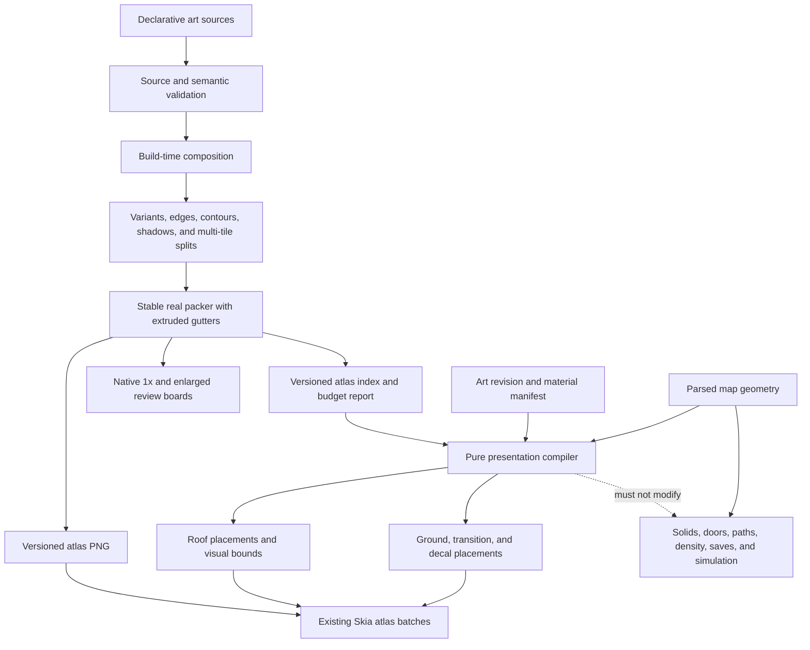

# Implement the Halcyra art-quality program

## 1. Outcome

Replace the current repeated test-grid look with an original warm-noir pixel diorama while keeping the proven runtime architecture.

The program will:

- improve source art, material variation, boundaries, roofs, walls, objects, characters, and portraits;
- compile all source layers into one deterministic flat atlas;
- select ground variants, transitions, decals, and roof cells through presentation-only data;
- keep the existing Skia atlas batches, nearest-neighbor sampling, integer zoom, and movement system;
- pass a small hard prototype before broad art work starts;
- deliver each implementation phase through its own Grok audit, focused pull request, squash merge, and synchronized-main proof.

## 2. Source order

Use these sources in order:

1. `docs/specs/2026-08-11-art-quality.md`
2. `audits/phase-24-art-quality-spec-council-audit.md`
3. `audits/phase-24-grok-audit.md`
4. this implementation plan after its council and Grok closure audits
5. newly merged `main` before each implementation phase

If code conflicts with the final specification, stop that slice and correct the conflict. Do not silently weaken the specification to fit the current code.

## 3. Local research result

The renderer is not the main quality problem. Keep it.

The repository already has:

- one deterministic RGBA atlas;
- batched Skia floor, prop, character, wall, roof, and effect layers;
- `32x32` world tiles and `24x30` character cells;
- eight generated walk cells and one `40x44` portrait per character;
- `145 ms` walk timing and the Phase 23 continuous movement proof;
- four compiled `64x48` maps with one authority for solids, doors, approaches, roofs, routes, and density;
- packaged responsive, restart, save, maximum-load, and natural-movement evidence.

The implementation must first correct these pipeline blockers:

1. `scripts/art/build-world-atlas.ts` uses a fixed `512`-pixel shelf packer. It has no `1024x1024` hard limit, real-packer forecast, category budget, or occupancy report.
2. Its one-pixel spaces are transparent blanks. The final specification requires extruded gutters and controlled transparent RGB.
3. `scripts/art/__tests__/atlas-generation.test.ts` freezes the ten weak ground cells by exact pixel hash and requires transparent gutters.
4. `scripts/art/build-review-sheet.ts` overwrites Phase 4 and Phase 19 evidence.
5. `art:atlas` first runs `build-character-variants.ts`, which derives seven named sources from the playable generic resident and can overwrite authored identity work.
6. `CompiledMapV2` has geometry data but no presentation-only material index.
7. `WorldScene.tsx` renders every visible ground tile from one public sprite and renders every roof from `tile.boardwalk` plus a hard-coded tint.
8. Current culling starts from anchor tiles. New overhangs need explicit visual bounds.
9. `ATLAS_PROOF_BILL` treats the current public cells as the complete review set. Internal variants and transitions need a separate review bill.
10. The current worktree contains unrelated evidence and user-owned generated files. Every phase must stage exact paths only.

No external framework research is required. This work uses local TypeScript, React, Skia, PNG tooling, map compilation, and packaged smoke infrastructure.

## 4. Locked contracts and non-goals

Every phase preserves:

- `32x32` world tiles;
- `24x30` world-character cells;
- exactly eight cells per character: two front, rear, left, and right frames;
- one `40x44` portrait per current character;
- approximately `145 ms` per walk frame at world speed `1`;
- discrete `1x`, `2x`, and `3x` world zoom;
- nearest-neighbor sampling and integer final screen placement;
- build-time source composition and flat runtime atlas cells;
- current movement, collision, door, object-footprint, roof-hide, depth, save, local-model, and responsive behavior;
- four current maps and stable public sprite IDs;
- Tier A Sunward Villas and Tier B regression-only scope for the other three districts.

This program does not add runtime paper dolls, full side profiles, geometry, solids, rooms, routes, portals, interactions, businesses, story content, save data, simulation randomness, dynamic lights, shaders, weather, combat animation, sitting, romance animation, jobs, vehicles, or a map `layoutRevision` change.

## 5. Architecture



The presentation compiler is pure and deterministic. It can read parsed map material ownership and art metadata. It cannot write to geometry, state, or saves.

## 6. Program dependency order

| Phase | Branch | Required result | Blocks |
|---|---|---|---|
| 26 | `codex/phase-26-art-foundation` | safe deterministic build, budget, evidence isolation, and art bible | all visible art work |
| 27 | `codex/phase-27-art-presentation` | presentation-only material, edge, decal, roof, and bounds runtime path with legacy-looking sources | hard visual prototype |
| 28 | `codex/phase-28-art-prototype` | three-character and Sunward material prototype passes all eleven hard gates | every broad art phase |
| 29 | `codex/phase-29-full-cast-art` | all ten current characters and portraits pass identity and movement gates | final qualification |
| 30 | `codex/phase-30-sunward-art` | complete Tier A re-authoring of existing Sunward art | Tier B and final qualification |
| 31 | `codex/phase-31-tier-b-art` | shared and district-specific re-authoring of existing Tier B cells and placements only | final qualification |
| 32 | `codex/phase-32-art-qualification` | complete packaged matrix, performance, lifecycle, provenance, and release gate | program completion |

Phases are sequential. Start a phase only after the prior pull request is squash-merged and local `main`, `origin/main`, and the merge SHA are equal.

## 7. Phase 26: deterministic art foundation

### 7.1 Purpose

Change the art pipeline without intentionally changing the visible inner pixels of production cells. Make later authoring safe, measurable, and reversible.

### 7.2 Files

Modify:

- `scripts/art/build-world-atlas.ts`
- `scripts/art/character-source.ts`
- `scripts/art/build-character-variants.ts` or remove it if no safe use remains
- `scripts/art/build-review-sheet.ts`
- `scripts/art/check-generated-art.ts`
- `scripts/art/png.ts`
- packaged smoke scripts that currently default to Phase 14, 22, or 23 evidence paths
- `scripts/art/__tests__/atlas-generation.test.ts`
- `src/render/atlas.ts`
- `src/render/__tests__/atlas-bill.test.ts`
- `App.tsx` only if the current resource gate needs atlas/index mismatch handling
- `package.json`
- `.github/workflows/ci.yml`

Add:

- `scripts/art/atlas-pack.ts`
- `scripts/art/atlas-budget.ts`
- `scripts/art/art-manifest.ts`
- `scripts/art/build-art-quality-review.ts`
- focused tests for the new packer, budget, and manifest
- `assets/source/art/manifest.json`
- a non-playable character scaffold if a scaffold is still required
- `docs/art/halcyra-art-bible.md`
- `docs/art/reference-analysis.md`
- `artifacts/phase-24/art-quality/phase-26-foundation/`

### 7.3 Work

1. Define one versioned art manifest with `artRevision`, public IDs, internal categories, category ceilings, source tool version, and the final-spec budget.
2. Replace the fixed shelf code with one exported stable packer. Sort by a documented stable key. Pack the same input to byte-identical positions.
3. Enforce maximum dimensions of `1024x1024`.
4. Report category counts, raw rectangle area, packed dimensions, packed bounding area, atlas occupancy, and largest cells.
5. Send dimension-correct placeholders for every unused category allowance through the same packer. Fail above `70%` raw area, `80%` projected packed bounding area, or either `1024`-pixel dimension.
6. Add one-pixel extruded gutters. The atlas rectangle continues to identify the inner cell. Validate edge extrusion, corner extrusion, no bleed between cells, and controlled RGB when alpha is zero.
7. Bump the atlas contract atomically if gutter meaning or index fields change. Update generator, parser, proof bill, packaged asset, and tests in the same phase.
8. Put an atlas PNG digest and the art revision in generated metadata. Verify image/index agreement during build and packaged qualification. Runtime must fail closed to the existing resource-error state on a known mismatch.
9. Add one generated runtime-readable signature cell or an equivalent runtime-readable signature. The boot resource gate compares it with the index metadata. A build-only digest check is not sufficient for stale-atlas boot detection.
10. Write temporary PNG, index, and report candidates. Decode and validate them before replacing tracked outputs. A partial write must never be reported as a valid build.
11. Stop `art:atlas` from rewriting authored character files. Current ten character JSON files become authoritative. If a scaffold command remains, it writes only an explicit new destination and never overwrites a current identity without a separate force flag.
12. Separate public runtime cells from internal review cells. Public map sprite validation cannot require internal variants in map JSON.
13. Remove review-sheet generation from the normal atlas build. Add an explicit review command with a required `--output-root` under `artifacts/phase-24/art-quality/`.
14. Add one explicit `--output-root` to every packaged smoke that currently writes Phase 14, 22, or 23 paths. A smoke run must reject a historical evidence root during this program. Default local `verify` output goes under untracked `output/verification/`; only an explicit phase root creates tracked evidence.
15. Preserve Phase 4, 19, 22, and 23 evidence byte-for-byte. Update `art:check` so it no longer regenerates historical images.
16. Replace weak per-ground pixel locks only after the old cells have revisioned baseline hashes and stronger semantic checks. Keep whole-build determinism, bounds, dimensions, public ID reachability, foot motion, and source-to-output checks.
17. Write the art bible before visual authoring. Include palettes, light direction, contours, density, transitions, character proportions, materials, districts, good samples, rejected samples, and imitation limits.
18. Require every phase that changes generated cell pixels to bump `artRevision` and regenerate its revisioned hashes in the same commit. `art:check` fails a pixel-hash change without the paired revision change.
19. Capture a clean pre-art performance reference and the exact measurement method. This is a methodology and historical reference, not the later regression oracle. Every performance hard gate compares baseline and enhanced modes from the same package on the same machine, camera, window, DPR, and zoom.

### 7.4 Tests first

- stable pack ordering and byte-identical output;
- exact `1024x1024` pass and one-pixel overflow failure;
- real-packer placeholder forecast and category reduction message;
- edge and corner gutter extrusion;
- transparent-RGB policy;
- partial candidate rejection and atlas/index mismatch failure;
- stale-atlas boot rejection through the runtime-readable signature;
- public IDs remain reachable;
- ten authoritative character sources are not rewritten by `art:atlas`;
- review output cannot target a historical phase path;
- existing inner source-cell pixels remain unchanged in this phase.

### 7.5 Gate

```sh
npx jest --runInBand --runTestsByPath \
  scripts/art/__tests__/atlas-generation.test.ts \
  scripts/art/__tests__/atlas-pack.test.ts \
  scripts/art/__tests__/atlas-budget.test.ts \
  src/render/__tests__/atlas-bill.test.ts \
  src/application/__tests__/shell-state.test.ts \
  src/application/__tests__/renderer-readiness.test.ts \
  tests/electron/package-smoke.test.ts
npm run art:check
npm run content:check
npm run validate:content
npm run check:boundaries
npm run typecheck
npm test -- --runInBand
npm run export:web
npm run package:electron
npm run art:review -- --output-root artifacts/phase-24/art-quality/phase-26-foundation
npm run smoke:responsive:qualification -- --output-root artifacts/phase-24/art-quality/phase-26-foundation/performance-baseline
```

Evidence records the source commit, atlas/index/report hashes, baseline inner-cell hashes, forecast, pack result, and new review-board paths.

### 7.6 Stop and rollback

Do not start Phase 27 if the forecast fails or the visible inner pixels change without an approved reason. Reverting this pull request restores the prior atlas format without map or save changes.

## 8. Phase 27: pure presentation system

### 8.1 Purpose

Add the complete deterministic runtime path for variants, transitions, decals, roofs, and visual bounds while current source recipes still render the legacy-looking public cells. This separates architecture risk from subjective art review.

### 8.2 Files

Add:

- `src/world/presentation/art-presentation.ts`
- `src/world/presentation/material-selection.ts`
- `src/world/presentation/material-transitions.ts`
- `src/world/presentation/visual-bounds.ts`
- `src/world/presentation/__tests__/art-presentation.test.ts`
- `scripts/art/__tests__/material-selection.test.ts`
- `scripts/art/__tests__/transition-topology.test.ts`
- material, roof, and decal recipe source files under `assets/source/art/`

Modify:

- `scripts/art/art-manifest.ts`
- `scripts/art/build-world-atlas.ts`
- `scripts/art/check-generated-art.ts`
- `src/world/maps/compiled-v2.ts`
- `src/world/maps/compiler.ts` only to attach a separate presentation result after geometry compilation
- `src/world/maps/catalog.ts`
- `src/render/WorldScene.tsx`
- `src/render/atlas.ts`
- `src/render/world-frame.ts`
- culling and atlas tests
- `package.json`

Do not add internal sprite IDs to map JSON, state schemas, save fixtures, or domain events.

### 8.3 Work

1. Define material recipes with a stable public base ID, internal variants, palette ramp, density band, edge mode, decal family, transition priority, and `selectionSalt`.
2. Implement the non-commutative, length-prefixed tuple hash from the final specification.
3. Resolve tile candidates in row-major order. Prevent an all-identical `2x2` by checking left, upper-left, and upper selections.
4. Add the canonical `12x12` distribution test and count-band failure report.
5. Implement corner-aware sixteen-case marching-squares or equivalent quarter-Wang resolution for `soft` and `built` families. Include straight, inner, outer, saddle, island, strip, unequal-priority junction, and equal-priority tie cases.
6. Compile deterministic decals as non-solid presentation placements. They cannot enter map density or object ownership.
7. Compile roof material cells from map ID plus roof-group ID without changing roof masks or ownership.
8. Add full visual bounds for overhang and culling. Bounds affect visibility only.
9. Return one immutable presentation index containing final ground, transition, decal, roof, and bounds data.
10. Add presentation placements to the existing floor and roof atlas inputs. Use at most one additional static Skia batch. Add no per-cell React component, timer, random call, or domain command.
11. Remove the hard-coded boardwalk roof and tint only after an equivalent authored fallback roof recipe exists.
12. Prove fresh start, load, resize, zoom, map transfer, and restart produce the same presentation hash.
13. Prove the presentation compiler cannot change `blockedKeys`, `staticSolidOwnerByTile`, doors, approaches, routes, density, layout revisions, save data, reservations, or the simulation PRNG state.
14. Add a smoke-only switch that renders the legacy baseline path and the enhanced presentation path in the same package. It is unavailable in normal gameplay.
15. Run the Phase 22 maximum-load camera against both modes with identical package, machine, camera, window, DPR, and zoom inputs.
16. Extend the packaged performance runner with explicit `--compare-art-modes` and `--include-maximum-load` flags. Its validator requires both mode records, matching inputs, FPS, median frame time, draw counts, package provenance, and the tested source commit.

### 8.4 Tests first

- tuple encoding prevents ambiguous concatenation and coordinate/material swaps;
- same source and map produce the same presentation bytes;
- restart and traversal order do not change selection;
- no identical `2x2` and valid count band on canonical boards;
- every transition topology and priority tie;
- decals remain presentation-only;
- roofs use the same cell masks as before;
- visual bounds expand culling but not solids;
- public sprite validation ignores internal IDs;
- draw batches stay bounded and static inputs retain identity across movement frames.

### 8.5 Gate

```sh
npx jest --runInBand --runTestsByPath \
  scripts/art/__tests__/atlas-generation.test.ts \
  scripts/art/__tests__/material-selection.test.ts \
  scripts/art/__tests__/transition-topology.test.ts \
  src/world/presentation/__tests__/art-presentation.test.ts \
  src/world/__tests__/map-v2.test.ts \
  src/world/__tests__/map.test.ts \
  src/render/__tests__/atlas-bill.test.ts \
  src/render/__tests__/world-frame.test.ts
npm run art:check
npm run content:check
npm run validate:content
npm run check:boundaries
npm run typecheck
npm test -- --runInBand
npm run export:web
npm run package:electron
npm run smoke:electron -- --output-root artifacts/phase-24/art-quality/phase-27-presentation/world
npm run smoke:presentation-restart -- --output-root artifacts/phase-24/art-quality/phase-27-presentation/restart
npm run smoke:responsive:qualification -- --compare-art-modes --include-maximum-load --output-root artifacts/phase-24/art-quality/phase-27-presentation/performance
```

### 8.6 Stop and rollback

Do not start visual authoring if the dual-mode maximum-load report is absent or invalid, any geometry hash changes, a presentation hash is unstable, batching exceeds the final-spec limit, the enhanced path falls below `60 FPS`, or median frame time regresses by more than `10%` against the same-package baseline. A failed material or transition recipe must fall back to its public base cell and still report a qualification failure.

## 9. Phase 28: hard Sunward prototype

### 9.1 Purpose

Prove the art direction and the cheap character method at native `1x` before full-cast or Tier B work.

### 9.2 Bounded source scope

Only these characters:

- protagonist;
- Linda;
- generic resident.

Only this environment proof:

- warm sand, dune grass, villa floor, spa stone, shallow water, and one roof material;
- at least one soft and one built transition family;
- villa wall and door;
- sofa;
- table;
- planter;
- palm;
- lamp;
- one existing multi-tile landmark.

Do not author a fourth character or a Tier B art family in this phase.

### 9.3 Files

Modify the three character sources, relevant art recipes and environment sources, atlas builders, review generators, presentation metadata, renderer only for verified defects, art tests, package scripts, and generated outputs.

Add:

- `scripts/electron/run-art-quality-package-smoke.ts`
- `tests/electron/art-quality-smoke.test.ts`
- `src/render/art-quality-evidence.ts`
- `artifacts/phase-24/art-quality/phase-28-prototype/`

### 9.4 Work

1. Author all prototype pixels from the art bible. Do not accept unreviewed image-generator output as production art.
2. Give each common natural prototype material four to eight variants. Give structured materials two or more variants or an approved coordinate-phase recipe.
3. Add low-contrast decals, transition cells, and an authored roof that preserve path and door readability.
4. Use review boards for a prototype material that is not present in the current Sunward start map. Do not add a live-map patch or placement only to satisfy the board.
5. Compose the multi-tile object before splitting. Extrude gutters after splitting. Reject internal alpha or outline seams.
6. Add generated outward character contours after layer composition. Enforce top, left, and right source margins and the bottom foot-open rule.
7. Keep the current rear derivation and lateral body method. Add one mirrored three-quarter head and hair source only if the native-`1x` lateral proof fails. Record that decision.
8. Match portrait and world identity from the same tokens.
9. Preserve all Phase 23 direction, foot, bounce, lean, shadow, curve, and reduced-motion behavior.
10. Test closed-unlocked and closed-locked door presentation with a pure presentation fixture when those states are not active in the current player flow. Do not change a live map to create the test.
11. Render the protagonist, Linda, and generic-resident portrait fixtures in the current dark conversation panel at UI scales `1`, `1.25`, and `1.5`. Prove identity match and unchanged transcript and input readability.
12. Reuse the Phase 27 same-package baseline/enhanced switch for measured before/after comparison. Do not expose it in normal gameplay.
13. Make the smoke runner state-based: wait for exact ready state and two paints, use one absolute deadline, decode PNG dimensions and pixels, and reject blank or stale frames.
14. Record the tested source commit and hashes for atlas, index, manifest, maps, renderer, and smoke files.

### 9.5 Eleven hard gates

Phase 29 cannot start until all are true:

1. Every prototype character, material, roof, wall, door, object, vegetation, and landmark family has its required section 14.1 art-bible entry.
2. Warm sand, dune grass, villa floor, spa stone, and shallow water pass section 14.2 `12x12` boards, automated count checks, and native-`1x` review.
3. The prototype soft and built transition families pass every section 14.3 topology case and junction, and the roof passes a base, edge, and corner board. Roof art does not use the terrain count band.
4. The protagonist, Linda, and generic resident pass all section 14.4 identity, direction, foot, contour, portrait-match, and native-`1x` checks. Each has eight reachable `24x30` cells, a matching `40x44` portrait, and a readable conversation-panel fixture at UI scales `1`, `1.25`, and `1.5`.
5. The fixed Sunward camera passes the section 14.5 six-question Tier A review: questions 1-3 and at least five of six total.
6. The prototype door, wall, sofa, table, planter, palm, lamp, and landmark pass section 14.6 collision and depth checks. This includes open and fixture-only closed door states, room entrances, a portal with the new cells, player-in-front and player-behind frames for each tall-prop class, multi-tile seams, and the landmark depth anchor.
7. The complete generated atlas passes every section 14.7 integrity check: identical bytes, public-ID reachability, bounds, extruded gutters, transparent-RGB hygiene, no bleed, matching versions and signature, `1024x1024` cap, decoded-memory cap, and no filtering at every supported zoom and DPR.
8. The prototype and Phase 22 maximum-load packaged cameras pass section 14.8 with at least `60 FPS`, no more than `10%` median-frame-time regression against the same-package baseline, and no more than one added static batch.
9. With prototype art enabled, fresh start, compatible save load, resize, every zoom, all four map transitions, and app restart keep the same presentation choices and pass section 14.9 without a save or `layoutRevision` change.
10. The real-packer full-program placeholder projection passes the section 11.3 raw-area, packed-area, dimension, and actual-prototype pack gates.
11. Grok's implementation audit has every confirmed high- or medium-impact finding fixed and no unresolved confirmed material finding.

The tracked Tier A review record answers the six section 14.5 questions one by one, names the reviewer, links the exact native-`1x` frame, and records pass or fail. Questions 1-3 and at least five of six total must pass. Direct user feedback overrides an external reviewer preference.

### 9.6 Evidence

Track under `artifacts/phase-24/art-quality/phase-28-prototype/`:

- art bible version and source provenance;
- native `1x` and enlarged `3x` atlas sheets;
- three-character direction, foot, contour, and portrait matrix;
- five `12x12` material boards at `1x` and `3x`;
- transition and three-material junction boards;
- roof, wall, door, object, and seam boards;
- player-in-front and player-behind frames for each prototype tall-prop class and the landmark depth anchor;
- room-entrance and portal frames with the new cells;
- conversation-panel portrait frames at UI scales `1`, `1.25`, and `1.5`;
- fixed-camera before/after images at `1x`, `2x`, and `3x`;
- ordered normal and reduced-motion walking frames;
- restart, save-load, roof, and performance reports.

### 9.7 Gate

```sh
npx jest --runInBand --runTestsByPath \
  scripts/art/__tests__/atlas-generation.test.ts \
  scripts/art/__tests__/material-selection.test.ts \
  scripts/art/__tests__/transition-topology.test.ts \
  src/world/presentation/__tests__/art-presentation.test.ts \
  src/world/__tests__/map-v2.test.ts \
  src/world/__tests__/map.test.ts \
  src/render/__tests__/world-frame.test.ts \
  tests/electron/art-quality-smoke.test.ts
npm run art:check
npm run content:check
npm run validate:content
npm run check:boundaries
npm run typecheck
npm test -- --runInBand
npm run package:electron
npm run smoke:art-quality -- --output-root artifacts/phase-24/art-quality/phase-28-prototype
npm run smoke:natural-movement -- --output-root artifacts/phase-24/art-quality/phase-28-prototype/movement
npm run smoke:responsive:qualification -- --output-root artifacts/phase-24/art-quality/phase-28-prototype/responsive
npm run smoke:presentation-restart -- --output-root artifacts/phase-24/art-quality/phase-28-prototype/restart
npm run smoke:save-migration -- --output-root artifacts/phase-24/art-quality/phase-28-prototype/save
```

### 9.8 Stop and rollback

If the prototype fails, fix only the failed recipe or presentation layer and repeat this phase audit. Do not start broad art. Revert a failed family to its stable public base cell. Do not change geometry or remove collision to make art pass.

## 10. Phase 29: full current cast

### 10.1 Scope

Upgrade the remaining seven character identities. Keep exactly ten current identities. Do not add NPCs.

### 10.2 Work

1. Make all ten character source files directly authoritative.
2. Provide at least three clear body or torso silhouettes across the cast.
3. Give every named character at least two non-color differences from every other named character at native `1x`.
4. Require one non-color identity feature to survive front, rear, and lateral generation.
5. Document direction visibility for hair, hats, glasses, accessories, outfit shape, and held items.
6. Keep the generated rear and default lateral methods. Apply the approved three-quarter fallback only to a character that fails its recorded `1x` proof.
7. Keep skin and hair value separation, source margins, contour bounds, foot alternation, and portrait match.
8. Generate a complete ten-character direction, foot, silhouette, contour, and portrait matrix.
9. Run standard and reduced-motion movement with more than one actor so each actor keeps independent direction and walk phase.
10. Render all ten portraits in the current dark conversation panel at UI scales `1`, `1.25`, and `1.5`. Prove portrait/world identity and unchanged transcript and input readability.

### 10.3 Files and evidence

Modify all ten character sources only when needed, shared character grammar, contour and portrait builders, character semantic tests, review generator, atlas/index/report, and packaged art smoke.

Track evidence under `artifacts/phase-24/art-quality/phase-29-full-cast/`, including the complete conversation-panel portrait matrix at UI scales `1`, `1.25`, and `1.5`.

### 10.4 Gate

```sh
npx jest --runInBand --runTestsByPath \
  scripts/art/__tests__/atlas-generation.test.ts \
  scripts/art/__tests__/rear-frame.test.ts \
  src/render/__tests__/atlas-bill.test.ts \
  src/render/__tests__/world-frame.test.ts \
  tests/electron/art-quality-smoke.test.ts
npm run art:check
npm run typecheck
npm test -- --runInBand
npm run package:electron
npm run smoke:art-quality -- --output-root artifacts/phase-24/art-quality/phase-29-full-cast
npm run smoke:natural-movement -- --output-root artifacts/phase-24/art-quality/phase-29-full-cast/movement
```

### 10.5 Stop and rollback

Revert an individual character source and regenerate if that identity fails. Do not revert the proven presentation system or change character dimensions.

## 11. Phase 30: complete Tier A Sunward art

### 11.1 Scope

Complete the art re-authoring for every material, wall, door, roof, sign, object, vegetation cell, and landmark already used in Sunward Villas. Presentation-only decals can enrich existing cells. Do not add geometry, object placements, solids, rooms, interactions, routes, businesses, or story content.

### 11.2 Work

1. Finish all Sunward material variants, transitions, and optional decals.
2. Make villa wall top/front faces, caps, corners, openings, and shadows clear at `1x`.
3. Match open, closed-unlocked, and closed-locked door art to the same one-cell opening and parent wall.
4. Complete roof materials, boundaries, optional vents or wear, and interior separation.
5. Re-author existing furniture, fixtures, vegetation, signs, and landmarks with material separation, contact shadows, and controlled asymmetry.
6. Compose and inspect every multi-tile object before splitting.
7. Prove every solid footprint cell has visible blocking mass and every decorative overhang keeps the walk lane clear.
8. Prove selected actors, doors, and interactions remain above ground detail in scene hierarchy.
9. Compare fixed cameras to the Phase 19 and Phase 22 baselines. Character scale stays unchanged.
10. Repeat the tracked section 14.5 six-question Tier A review against the completed Sunward art. Name the reviewer, link the exact native-`1x` full-color and grayscale frames, pass questions 1-3, and pass at least five of six total.

### 11.3 Files and evidence

Modify Sunward-used art recipes and sources, generated atlas/index/report, semantic tests, and review boards. Map-source changes are forbidden unless they are presentation-only references produced through the authoritative content builder and leave geometry hashes unchanged.

Track evidence under `artifacts/phase-24/art-quality/phase-30-sunward/`, including the completed-art Tier A six-question decision record.

### 11.4 Gate

```sh
npx jest --runInBand --runTestsByPath \
  scripts/art/__tests__/atlas-generation.test.ts \
  scripts/art/__tests__/material-selection.test.ts \
  scripts/art/__tests__/transition-topology.test.ts \
  src/world/presentation/__tests__/art-presentation.test.ts \
  src/world/__tests__/map-v2.test.ts \
  src/world/__tests__/map.test.ts \
  src/content/__tests__/production-content.test.ts \
  tests/electron/art-quality-smoke.test.ts
npm run art:check
npm run content:check
npm run validate:content
npm run check:boundaries
npm run typecheck
npm test -- --runInBand
npm run package:electron
npm run smoke:art-quality -- --output-root artifacts/phase-24/art-quality/phase-30-sunward
npm run smoke:natural-movement -- --output-root artifacts/phase-24/art-quality/phase-30-sunward/movement
npm run smoke:responsive:qualification -- --output-root artifacts/phase-24/art-quality/phase-30-sunward/responsive
```

### 11.5 Stop and rollback

Do not merge if the completed-art Tier A review fails. Roll back only the failed art family and regenerate. Never change a solid or approach cell to match a new silhouette in this program.

## 12. Phase 31: Tier B shared and district art

### 12.1 Scope

Re-author only material, wall, door, roof, sign, object, vegetation, fixture, and landmark cells already used by Neon Crescent, Palm Exchange, and Harbor Authority.

No new map object, render-part placement, room, wall run, interaction, solid, density, route, business, or story content is allowed.

### 12.2 Work

1. Complete variants and edges only for materials already used by each map.
2. Give all four wall families structural, not only color, differences at `1x`.
3. Give existing roof groups district-appropriate material identities.
4. Re-author existing signs, props, fixtures, vegetation, and landmarks without adding placements.
5. Use map-specific internal palette variants when one stable public material ID is shared.
6. Keep all public IDs and all authoritative content-builder outputs valid.
7. Compare before/after placement, solid-owner, route, density, interaction, and layout-revision hashes for all four maps. Only presentation hashes can change.
8. Generate Tier B regression boards and fixed-camera images at all zooms. Do not apply the Tier A scene-content gate to missing placeholder content.
9. When a Tier B map has no roof group, record the roof cases as `N/A` with the compiled-map evidence. Do not add a roof group to fabricate proof.
10. For each Tier B map, complete the tracked section 14.5 reduced shared-upgrade review: existing paths, doors, portals, walls, solids, characters, and signs are no less readable; the district palette is distinct at `1x`; shared art adds no blur, seam, false blocker, or false interaction; and no content placement or geometry was added.

### 12.3 Evidence

Track under `artifacts/phase-24/art-quality/phase-31-tier-b/`:

- material, transition, wall, door, roof, object, seam, and landmark boards;
- all three Tier B maps at `1x`, `2x`, and `3x`;
- unchanged geometry and content-authority report;
- atlas budget and public-ID report;
- responsive and performance report.
- one tracked reduced shared-upgrade decision record for each Tier B map.

### 12.4 Gate

```sh
npx jest --runInBand --runTestsByPath \
  scripts/art/__tests__/atlas-generation.test.ts \
  scripts/art/__tests__/material-selection.test.ts \
  scripts/art/__tests__/transition-topology.test.ts \
  src/world/presentation/__tests__/art-presentation.test.ts \
  src/world/__tests__/map-v2.test.ts \
  src/world/__tests__/map.test.ts \
  src/content/__tests__/production-content.test.ts \
  tests/electron/art-quality-smoke.test.ts
npm run art:check
npm run content:check
npm run validate:content
npm run check:boundaries
npm run typecheck
npm test -- --runInBand
npm run package:electron
npm run smoke:art-quality -- --output-root artifacts/phase-24/art-quality/phase-31-tier-b
npm run smoke:responsive:qualification -- --output-root artifacts/phase-24/art-quality/phase-31-tier-b/responsive
```

### 12.5 Stop and rollback

Do not merge a Tier B map that fails its reduced shared-upgrade review. If a Tier B change creates or moves content, remove it. Revert one district override or material recipe and regenerate. Never resolve an atlas binary conflict with `ours` or `theirs`; rebuild from merged sources.

## 13. Phase 32: integrated packaged qualification

### 13.1 Purpose

Prove the complete art program against every final-spec permutation from an exact packaged source commit.

### 13.2 Work

1. Freeze source and test changes in a source commit.
2. Package from that exact commit.
3. Generate final evidence after the source commit exists. Every report includes the tested commit and source hashes.
4. Validate `1280x720`, `1440x900`, `1920x1080`, `2560x1440`, and `1600x720`.
5. Validate DPR `1` and `2`, zoom `1x`, `2x`, and `3x`, and all four maps.
6. Validate idle, walk, talk, all directions, both foot frames, selected player, selected NPC, reduced motion, doorway, interior, roof restored, fresh start, compatible save load, map transition, resize, restart, normal load, and Phase 22 maximum load.
7. Validate player-in-front and player-behind rendering for every tall-prop class and each multi-tile depth anchor.
8. Validate every portrait in the current dark conversation panel at UI scales `1`, `1.25`, and `1.5`, with readable transcript and input.
9. Validate grayscale, protanopia, deuteranopia, and tritanopia for identity and material hierarchy.
10. Run deterministic art and presentation builds twice and require identical output before provenance fields.
11. Prove stable public IDs, atlas/index agreement, gutters, bounds, no bleed, multi-tile seams, portrait matches, and material boards.
12. Prove no save-schema, `layoutRevision`, solid-owner, route, interaction, density, or simulation-randomness change.
13. Require at least `60 FPS` and no more than `10%` median-frame-time regression from the same-package baseline on the same machine, camera, window, DPR, and zoom.
14. Add art-quality packaged qualification to supported CI jobs. Linux validates deterministic build and static export. Intel macOS and Windows validate package launch and the supported smoke subset.
15. Make no broad source change in this phase. A verified defect gets one narrow correction with affected regression and evidence rerun.

### 13.3 Evidence

Track final evidence under `artifacts/phase-24/art-quality/phase-32-final/` and include one machine-readable manifest listing every required case, file hash, tested commit, package path, platform, and pass result.

### 13.4 Final gate

```sh
npm run content:check
npm run validate:content
npm run art:check
npm run audio:check
npm run proof:check
npm run verify:first-hour
npm run check:boundaries
npm run typecheck
npm test -- --runInBand
npm run export:web
npm run test:electron:unit
npm run test:model
npm run package:electron
npm run smoke:electron -- --output-root artifacts/phase-24/art-quality/phase-32-final/world
npm run smoke:natural-movement -- --output-root artifacts/phase-24/art-quality/phase-32-final/movement
npm run smoke:art-quality -- --output-root artifacts/phase-24/art-quality/phase-32-final
npm run smoke:responsive:qualification -- --output-root artifacts/phase-24/art-quality/phase-32-final/responsive
npm run smoke:presentation-restart -- --output-root artifacts/phase-24/art-quality/phase-32-final/restart
npm run smoke:save-migration -- --output-root artifacts/phase-24/art-quality/phase-32-final/save
npm run verify
```

Do not call static export, unit tests, or one screenshot proof that the art looks correct. Native-`1x` boards, fixed-camera packaged scenes, movement frames, lifecycle reports, and performance data are required.

## 14. Required behavior and permutation trace

| Player flow | First phase that proves it | Final proof |
|---|---:|---:|
| start or load without migration | 27 | 32 |
| deterministic material selection after restart | 27 | 32 |
| pan and zoom without bleed or blur | 28 | 32 |
| walk with correct identity, feet, bounce, lean, and shadow | 28 | 32 |
| two actors keep independent direction and foot phase | 29 | 32 |
| enter, leave, hide, and restore a roof | 28 | 32 |
| wall, door, object, and path visuals match collision | 28 | 32 |
| portrait and world sprite identify the same person | 28 | 32 |
| all Sunward existing art reaches Tier A quality | 30 | 32 |
| all Tier B existing art upgrades without content expansion | 31 | 32 |
| resize, map transfer, save load, and restart keep visual choices | 27 | 32 |
| maximum load meets the frame budget | 27 | 32 |

The evidence manifest uses named case IDs rather than an uncontrolled full Cartesian product. At minimum it contains one case for every value in the final-spec review matrix and the cross-cases named in the phase gates. The validator rejects an omitted required case. It permits `N/A` only with a machine-readable reason and supporting compiled-map fact, such as a Tier B map with no roof group.

## 15. Failure behavior

| Failure | Required result |
|---|---|
| unknown public sprite | build failure with source path and ID |
| missing internal variant | development fallback to public base plus qualification failure |
| invalid transition mask | base-material fallback plus qualification failure |
| atlas exceeds a category or packing limit | build failure with reduction order and largest cells |
| PNG and index disagree | resource gate stays blocked; no gameplay entry |
| presentation selector fails | stable public base; no simulation or save change |
| art source would clip a character contour | build failure naming character, direction, frame, and side |
| multi-tile split has a seam | art gate failure; geometry remains unchanged |
| roof material is missing | explicit fallback cell and qualification failure; never boardwalk tint |
| visible silhouette conflicts with collision | art family rolls back; collision is not weakened |
| native `1x` identity or readability fails | fix the smallest source layer; use three-quarter head only after the lateral proof fails |
| performance falls below the budget | roll back the affected presentation layer or family; keep batching |
| evidence commit differs from tested source | reject evidence and regenerate from the exact source commit |
| CI job does not start because of account billing | record the exact GitHub annotation; do not report a code failure |

## 16. Test and evidence rules

1. Write focused tests before each implementation slice.
2. Before each art phase, record semantic fingerprints for `layoutRevision`, source geometry, solids, doors, approaches, portals, routes, density, location bindings, save shape, and replay state. Any art-only change to a fingerprint fails the phase.
3. Preserve byte-identical generation for identical source and tool versions.
4. Use semantic visual checks for dimensions, topology, distribution, identity, source margins, feet, gutters, bounds, IDs, and geometry separation.
5. Use tracked native-`1x` visual boards for properties that code cannot prove.
6. Build packaged evidence from a committed source SHA.
7. Wait for exact UI state and two paints. Do not use a fixed delay as readiness proof.
8. Decode screenshots and validate dimensions and non-blank pixels. Do not use compressed file size as visual proof.
9. Use one absolute deadline for a bounded smoke journey.
10. Record baseline and enhanced results from the same package, machine, camera, window, DPR, and zoom for performance comparison.
11. Keep every phase in its own subdirectory under `artifacts/phase-24/art-quality/`. Never overwrite Phase 4, 19, 22, or 23 evidence.

## 17. Per-phase Grok, commit, pull request, and merge protocol

Repeat these steps for Phases 26 through 32:

1. Confirm prior phase PR is merged.
2. Check out local `main`, fetch, fast-forward, and prove `main...origin/main` is `0 0`.
3. Create the exact phase branch from that SHA.
4. Record the base SHA in the phase audit.
5. Implement only the phase scope and run narrow tests during work.
6. Run the phase gate.
7. Commit source and tests before package evidence when evidence needs a real source SHA.
8. Generate evidence from that exact source commit and commit only that phase's evidence.
9. Give Grok 4.5 one bounded high-reasoning audit pack: final specification, this plan, phase diff, generated index/report, evidence manifest, and test output. Include generated binary paths and staged-index proof.
10. Verify every finding locally. Fix confirmed findings. Record rejected findings with evidence.
11. Rerun affected checks. Request a correction audit when a material fix changed code, art, or evidence.
12. Require `NO_CONFIRMED_FINDINGS` or an explicit record that every remaining item is non-material and deferred outside this program.
13. Stage exact paths. Never stage existing Phase 14 or 22 evidence, manual Phase 23 frames, `output/`, or either user-owned `Codex Image 10 Aug 2026...png` file.
14. Push one focused branch and create one focused PR.
15. Record a GitHub Actions billing annotation exactly if jobs cannot start. Do not call it a code failure.
16. Use a normal squash merge. Do not use an administrator bypass.
17. Delete the phase branch only after merge.
18. Prove the local main SHA, remote main SHA, and PR merge SHA are identical with `0 0` divergence before the next phase.

## 18. Phase 25 plan council and closure protocol

Before Phase 26 starts:

1. Fable 5 at `xhigh`, Opus 5 at `xhigh`, and Grok 4.5 at `high` independently audit the same committed plan draft.
2. Their review scope is the final specification, this plan, and the named repository files needed to verify feasibility.
3. Codex normalizes duplicate findings, verifies them locally, and records disposition in `audits/phase-25-art-quality-plan-council-audit.md`.
4. Codex edits the plan for confirmed findings.
5. Grok 4.5 performs a final high-reasoning closure audit of the corrected plan and council record.
6. Codex fixes confirmed closure findings and repeats the Grok audit when the correction is material.
7. Phase 25 runs typecheck and the full Jest suite, then uses one focused PR and normal squash merge.
8. Phase 26 starts only from the synchronized Phase 25 merge SHA.

## 19. Acceptance checklist

- [x] Fable 5, Opus 5, and Grok 4.5 plan reviews are complete and recorded.
- [x] Confirmed council findings are integrated into this plan.
- [ ] Final Grok plan closure has no unresolved confirmed material finding.
- [ ] Phase 25 PR is squash-merged and synchronized.
- [ ] Phase 26 deterministic art foundation is Grok-audited and merged.
- [ ] Phase 27 pure presentation system is Grok-audited and merged.
- [ ] Phase 28 hard Sunward prototype passes all eleven gates, is Grok-audited, and is merged.
- [ ] Phase 29 full current cast is Grok-audited and merged.
- [ ] Phase 30 complete Tier A Sunward art is Grok-audited and merged.
- [ ] Phase 31 Tier B existing-art upgrade is Grok-audited and merged.
- [ ] Phase 32 integrated packaged qualification is Grok-audited and merged.
- [ ] Local `main`, `origin/main`, and final PR merge SHA are equal with `0 0` divergence.
