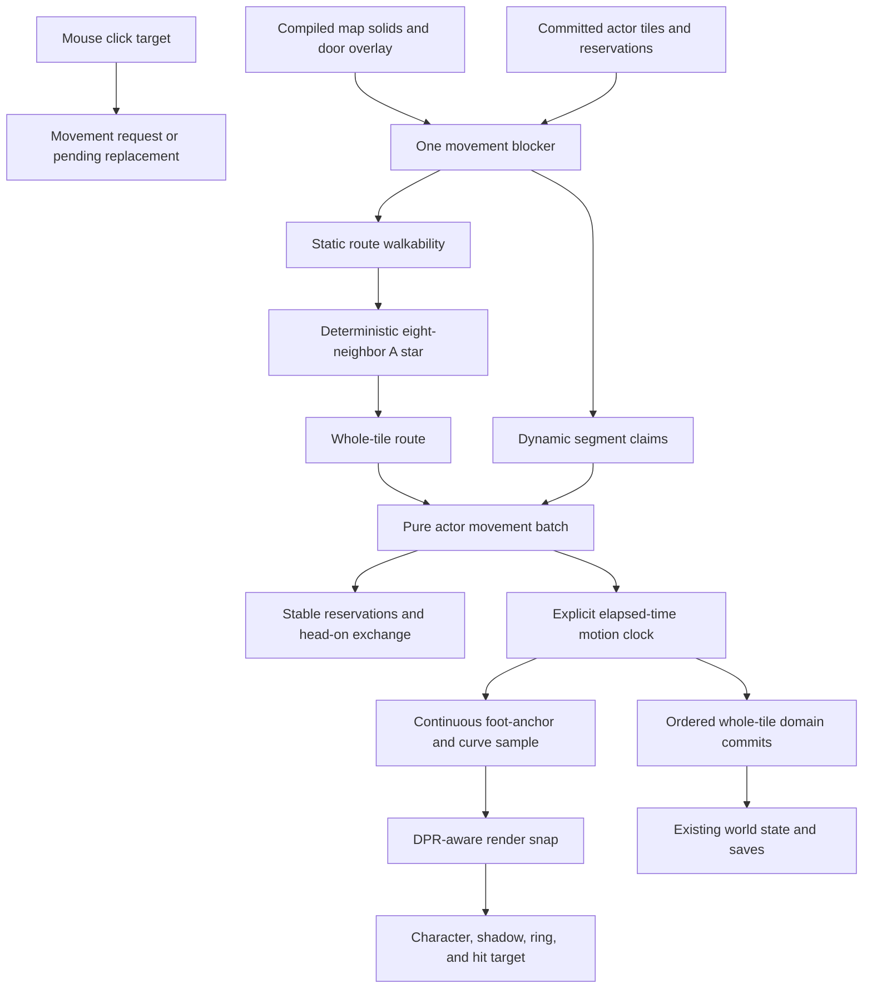

# Add natural click-to-move and readable walking

## 1. Outcome

Replace tile teleporting and rigid cardinal routes with deterministic safe diagonal paths, continuous player and NPC movement, small collision-checked turn curves, and per-actor foot animation.

Keep these contracts:

- `32×32` map tiles;
- `24×30` character cells;
- exactly eight world atlas cells per character;
- compiled map v2 static-solid authority;
- integer `1x`, `2x`, and `3x` world zoom;
- whole-tile saved positions and domain commands;
- mouse click movement;
- no save-schema change.

## 2. Source order

Use these sources in order:

1. `docs/specs/2026-08-11-natural-movement.md`
2. `audits/phase-23-opus5-grok-spec-review.md`
3. this implementation plan
4. merged `main` at `b4b014397be82cdccee60cb3bed3ee3e9ef02ff1`

If code conflicts with the final specification, correct the conflict before continuing.

## 3. Local research result

The repository already has the required foundations:

- deterministic A* in `src/world/pathfinding/astar.ts`;
- pure movement state in `src/world/pathfinding/movement.ts`;
- compiled solids in `src/world/maps/compiled-v2.ts`;
- authoritative player tile commits in `src/application/runtime/world-runtime.ts`;
- authoritative NPC commits in `src/world/schedules/active-movement.ts`;
- generated front, rear, left, and right frame pairs in `assets/generated/world-atlas.png`;
- a locked base frame time of `145 ms` in `src/render/atlas.ts`;
- memoized static world batches and packaged responsive proof from Phase 22.

No external framework research is needed. The feature uses local pure TypeScript, React, Skia, and the existing packaged smoke system. Opus 5 and Grok supply the requested independent design review.

## 4. Architecture



Navigation decides legal whole-tile nodes. The motion clock decides transient progress. The renderer samples that progress. Only ordered tile commits enter world state.

## 5. Implementation slices

### Slice 1: deterministic eight-neighbor routing

Files:

- modify `src/world/pathfinding/astar.ts`;
- add `src/world/pathfinding/walkability.ts`;
- modify all imports of `findCardinalPath` in `src/world/maps/compiler.ts`, `src/render/smoke-geometry.ts`, production-content tests, map tests, and movement tests;
- expand `src/world/__tests__/pathfinding.test.ts`.

Work:

1. Add exported stable eight-neighbor offsets with integer step costs.
2. Replace Manhattan distance with octile distance.
3. Return total route cost with found paths.
4. Add one blocker source with `isStaticMovementBlocked()` for bounds, terrain, static solids, and door overlays, plus `isSegmentClaimBlocked()` that extends it with occupancy, edge claims, and reservations.
5. Apply the two-cardinal-side rule before every diagonal expansion.
6. Keep deterministic node comparison and byte-stable results.
7. Keep a small compatibility name only if a migration caller needs it during this slice. Remove it before final verification.

Tests first:

- direct diagonal path and cost;
- each blocked-corner permutation;
- water, wall, object, and closed-door rejection;
- cardinal one-tile corridor;
- deterministic equal-cost tie;
- production-map entrances, portals, interactions, and location bindings remain reachable.

Gate:

```sh
npx jest --runInBand --runTestsByPath src/world/__tests__/pathfinding.test.ts src/world/__tests__/map.test.ts src/content/__tests__/production-content.test.ts
```

### Slice 2: pure continuous movement and reservations

Files:

- add `src/world/movement/motion-clock.ts`;
- add `src/world/movement/reservations.ts`;
- add `src/world/movement/turn-curve.ts`;
- refactor `src/world/pathfinding/movement.ts` into the public request, cancel, and state facade;
- add `src/world/__tests__/motion-clock.test.ts`;
- add `src/world/__tests__/movement-reservations.test.ts`;
- add `src/world/__tests__/turn-curve.test.ts`.

Public state:

```ts
type MovementState = Readonly<{
  committedTile: TilePoint;
  visualFoot: WorldPoint;
  target?: TilePoint;
  pendingTarget?: TilePoint;
  path: readonly TilePoint[];
  segment?: Readonly<{
    from: TilePoint;
    to: TilePoint;
    elapsedMs: number;
    durationMs: number;
  }>;
  direction: MovementDirection;
  travelDistance: number;
  walkFrame: 0 | 1;
  reservations: readonly string[];
  stopAfterSegment: boolean;
  status: 'idle' | 'moving' | 'waiting' | 'unreachable';
  feedbackTile?: TilePoint;
}>;
```

The final names can differ, but every field above must have one clear owner.

Work:

1. Advance motion only through an explicit `elapsedMs`, effective speed, map, and blocker snapshot.
2. Clamp one elapsed input to `50 ms`.
3. Use `145 ms` cardinal and `205 ms` diagonal durations at speed 1.
4. Keep constant speed through ordinary segments.
5. Accumulate true world distance and derive each actor's two-frame gait from that distance.
6. Preserve the active segment when a new target or stop request arrives.
7. Reserve destination tiles before segment start.
8. Resolve claims player-first and then by stable NPC ID.
9. Detect one exact opposing edge pair before ordinary occupancy rejection. Start its atomic paired exchange as the only dynamic-occupancy exception.
10. Move other conflicts to stable waiting. After four failed claims, run yield search or replan around the current dynamic snapshot. If neither can progress, cancel the actor to idle until its target or blocker set changes.
11. Revalidate before commit. Never return an illegal commit.
12. Build a `6 px` quadratic turn fillet, expand it by a `3 px` foot radius, reserve its complete tile envelope, and use a fixed arc-length lookup table.
13. Disable an unstarted fillet when target replacement or stop is pending.
14. Use a straight segment when curve clearance or envelope reservation fails.

Pure output:

```ts
type MovementBatchResult = Readonly<{
  actors: Readonly<Record<string, MovementState>>;
  commits: readonly Readonly<{ actorId: string; from: TilePoint; to: TilePoint }>[];
  reservations: ReadonlyMap<string, string>;
}>;
```

Tests:

- five or more distinct samples in one cardinal segment;
- true constant distance per fixed delta;
- diagonal duration and distance;
- pause, resume, and delta clamp;
- click replacement and Escape with no snap;
- two claimants for one tile;
- ordered atomic head-on exchange;
- stable waiting and yield search;
- destination invalidation before commit;
- curve clearance, curve-envelope reservations, interrupt latch, and straight fallback;
- identical fixed-step traces and hashes across two runs.

### Slice 3: authoritative player and NPC runtime integration

Files:

- add `src/application/runtime/movement-frame.ts`;
- modify `src/application/runtime/world-runtime.ts`;
- modify `src/world/schedules/active-movement.ts`;
- modify `src/application/runtime/first-hour-golden.ts`;
- modify `src/application/runtime/transitions.ts` only if the new idle/segment contract requires it;
- update runtime, schedule, transfer, portal, roof, and first-hour tests.

Work:

1. Make `advanceMovementFrame()` the only function that can advance the pure movement batch and create tile commits. `WorldScene` can submit elapsed time, but it cannot advance an individual actor or create a movement domain command.
2. Store live `MovementState` records only in `WorldScene`'s ephemeral runtime state. Reconcile them from committed whole tiles after load, sleep, conversation state replacement, quest state replacement, and map transition.
3. Build one frame coordinator for the protagonist and all active local NPCs.
4. Submit player and NPC desired routes to one stable reservation batch.
5. Convert batch commits to existing `move-protagonist` and `move-npc` commands in returned commit order.
6. Check schedule-goal completion and transfer departure only after the owning NPC commit.
7. Check roof, area, location, interaction approach, and portal logic only from committed tiles.
8. Keep saves whole-tile. Reload starts idle at the saved committed tile.
9. Change first-hour automation to use a fixed pure movement delta until each route completes.

Tests:

- player and NPC move together without committed/reserved overlap;
- schedule and transfer completion;
- portal begins only after committed arrival;
- roof changes only after committed entry;
- save during a partial segment reloads at its last committed tile;
- first-hour golden remains deterministic.

### Slice 4: per-actor rendering and player input

Files:

- modify `src/render/WorldScene.tsx`;
- modify `src/render/world-frame.ts`;
- modify `src/render/atlas.ts`;
- add `src/render/movement-presentation.ts`;
- modify `src/ui/WorldInput.tsx` only for visible moving-NPC hit testing or smoke-only input;
- update `src/render/__tests__/world-frame.test.ts` and atlas presentation tests.

Work:

1. Replace movement `setTimeout` and global walk-frame intervals with one cleaned-up `requestAnimationFrame` driver.
2. Submit each clamped elapsed duration once to application-owned `advanceMovementFrame()`. Read its returned actor presentation and authoritative world state. Do not run a second movement clock in the renderer.
3. On a walkable click, create or replace only the player's movement request. Remove the old full-tile movement `setTimeout`. Escape sets `stopAfterSegment`; NPC selection uses the same stop request.
4. Freeze driver progress when effective speed is zero or a blocking panel, conversation, or transition is active.
5. Build one presentation input per actor: committed tile, visual foot anchor, facing, status, walk frame, and reduced-motion state.
6. Map up and up-diagonal to rear, down and down-diagonal to front, and pure horizontal travel to lateral cells.
7. Apply lean, bounce, and shadow shift per actor. Disable all three under reduced motion.
8. Snap the final transform with zoom and `window.devicePixelRatio`; keep pure world coordinates unrounded.
9. Depth-sort characters by snapped visual foot Y and stable actor ID. Keep roof authority on committed tiles.
10. Keep static floor, object, wall, and roof atlas data memoized outside the animation update.
11. Move the selection ring, `F` camera target, and NPC hit target with the visible foot anchor.
12. Remove normal path breadcrumb dots. Add a brief destination marker and preserve invalid feedback.
13. Expose bounded smoke movement trace state only when `window.siWorldSmokeMode === true`.

Tests:

- two actors can render different frames and directions together;
- idle resets to frame 1;
- reduced motion removes secondary movement only;
- physical-pixel snapping at zoom 1/2/3 and DPR 1/2;
- static atlas inputs retain referential identity across transient actor samples;
- selection and visible NPC hit targets follow rendered anchors.
- one click produces intermediate presentation samples before the first authoritative tile commit;
- Escape and NPC selection request a bounded stop instead of teleporting or immediately discarding an active segment.

### Slice 5: generated foot-readability gate

Files:

- extend `scripts/art/check-generated-art.ts`;
- add or update art-generation tests;
- modify only the leg commands in `assets/source/characters/*.json` if a production frame pair fails;
- regenerate `assets/generated/world-atlas.png` and `assets/generated/atlas-index.json` only when source legs changed.

Work:

1. Compare rows `21–29` for both frames in every front, rear, left, and right pair.
2. Require a changed shoe edge and changed lower-leg pixels.
3. Prove eight reachable `24×30` cells per character.
4. Inspect protagonist, Linda, and generic resident at `1x`, `2x`, and `3x`.
5. Keep the current atlas count. Do not add diagonal or idle cells.

Gate:

```sh
npm run art:check
```

### Slice 6: deterministic and packaged player-visible proof

Files:

- add `src/render/movement-evidence.ts`;
- add `scripts/electron/run-natural-movement-package-smoke.ts`;
- update `scripts/electron/package-smoke-utils.ts` only for reusable bounded input or evidence helpers;
- add `tests/electron/natural-movement-smoke.test.ts` for report validation;
- update `package.json` scripts;
- update `.github/workflows/ci.yml`;
- write final artifacts under `artifacts/phase-23/natural-movement/`.

Work:

1. Drive the pure clock with fixed `16 ms` deltas for deterministic trace capture.
2. Record path nodes, costs, samples, curve decisions, reservations, facing, walk frames, committed tiles, DPR-snapped positions, source hashes, and tested commit.
3. Capture ordered PNG frames for open diagonal, turn, interruption, crowd, and reduced-motion cases at `1x`, `2x`, and `3x`.
4. Prove at least five in-between render positions inside one cardinal segment.
5. Prove both frames for the protagonist and one moving NPC.
6. Re-run the Phase 22 maximum-load case with simultaneous actor movement and active camera pan. Require at least `55 FPS` and record draw counts.
7. Run the trace twice and require identical JSON content before source-provenance fields are added.
8. Add the movement smoke and report validator to local `npm run verify` and the supported CI package jobs.

Commands:

```sh
npm run smoke:natural-movement
npm run verify
```

## 6. Failure behavior

| Failure | Required result |
|---|---|
| target is statically blocked | no segment; red invalid marker; `NO ROUTE` |
| diagonal side cell is blocked | diagonal rejected; safe alternative or `NO ROUTE` |
| next actor tile is claimed | stable winner; loser waits without per-frame replan |
| exact head-on edge conflict | paired ordered exchange |
| turn envelope is unavailable | straight movement through legal path nodes |
| destination becomes invalid before commit | no domain command; release; return to committed center; wait or replan |
| app frame gap exceeds `50 ms` | clamp; no catch-up jump |
| game is paused | no progress and no foot-phase change |
| load occurs during prior movement | idle at saved committed tile |
| smoke hook used in normal game | unavailable |

## 7. Verification order

Run narrow checks after each slice. Before final audit, run:

1. `npm run content:check`
2. `npm run validate:content`
3. `npm run art:check`
4. `npm run verify:first-hour`
5. `npm run check:boundaries`
6. `npm run typecheck`
7. `npm test -- --runInBand`
8. `npm run export:web`
9. `npm run test:electron:unit`
10. `npm run test:model`
11. `npm run package:electron`
12. `npm run smoke:electron`
13. `npm run smoke:natural-movement`
14. `npm run smoke:responsive:qualification`
15. the final combined `npm run verify`

Do not call static export or unit tests proof that movement looks correct. The ordered movement frames, trace, and packaged smoke are required.

## 8. Audit, commit, and merge gate

1. Grok 4.5 audits this plan at high reasoning effort before implementation.
2. Correct confirmed plan findings and record the result in `audits/phase-23-grok-plan-audit.md`.
3. Implement only after the plan audit is clean enough to execute.
4. After all verification, commit source and tests first if evidence needs a source commit.
5. Regenerate final evidence against that exact source commit.
6. Grok 4.5 audits the implementation diff and evidence at high reasoning effort.
7. Correct confirmed implementation findings, rerun affected verification, and request one correction audit.
8. Stage only Phase 23 paths. If leg sources change, the regenerated `assets/generated/world-atlas.png` and `assets/generated/atlas-index.json` are required Phase 23 files and must be committed together. Commit packaged proof under `artifacts/phase-23/`. Never stage the two user-owned `Codex Image 10 Aug 2026...png` files or `output/`.
9. Push `codex/phase-23-natural-movement`, create one focused pull request, and use a normal squash merge.
10. If GitHub Actions cannot start because of the known account billing block, record the exact annotation. Do not call it a code failure and do not bypass protected rules.
11. Finish only when local `main`, `origin/main`, and the merged PR SHA are equal with `0 0` divergence.

## 9. Acceptance checklist

- [x] Open-space click route includes legal diagonal nodes.
- [x] No diagonal cuts a blocked corner.
- [x] One cardinal segment has at least five visible in-between positions at `1x`.
- [x] Safe turns use the `6 px` curve; unsafe turns fall back to straight segments.
- [x] Player and NPC foot frames are independent and readable.
- [x] NPC direction is not forced down.
- [x] Movement, shadows, selection, camera center, and hit target share the visible anchor.
- [x] Reduced motion remains continuous and removes secondary body motion.
- [x] Whole-tile domain, roof, portal, interaction, and save authority remains correct.
- [x] Two fixed-step traces match.
- [x] Maximum-load packaged movement stays at or above `55 FPS`.
- [x] Opus 5 and Grok specification review is recorded.
- [ ] Grok plan audit is recorded and corrected.
- [ ] Grok implementation and correction audits are recorded.
- [ ] PR is merged and synchronized.
