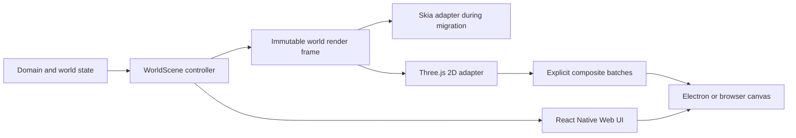

# Refactor SI World to top-down Three.js 2D

## 1. Outcome

Replace SI World's Skia world renderer with a production top-down Three.js 2D renderer.

Keep the current simulation, maps, saves, movement, input, UI, audio, accessibility, browser workflow, and Electron security boundary.

Reach the approved middle-panel visual direction from `spikes/001-threejs-pixel-villa/comparison-three-way.png`.
Do not build the isometric 2.5D panel.

Remove Skia, CanvasKit, old proof assets, obsolete scripts, temporary renderer selectors, stale package checks, and unused renderer-era dependencies after the Three.js build passes every gate.

The approved specification is authoritative:

- `docs/specs/2026-08-14-threejs-2d-renderer-port.md`

## 2. Locked implementation rules

1. Three.js is presentation only.
2. `WorldState`, save schemas, map geometry, pathfinding, collision, schedules, quests, AI, audio, and content do not change.
3. `WorldScene` remains the controller and the only owner of time advancement.
4. Both temporary renderers consume one immutable renderer-neutral frame.
5. Gameplay input keeps using `WorldInput` and current hit-testing functions.
6. The production renderer uses the generated world atlas directly.
7. Production never creates one texture, material, geometry, or Three.js object per tile.
8. The parity renderer uses `NoToneMapping`.
9. ACES is introduced only after measured parity passes.
10. Transparent composite order is manual and explicit.
11. Destination, journal, and failure feedback render above shelter shade, district lighting, and atmosphere.
12. Renderer choice is test-only, unsaved, and never player-facing.
13. The recorded qualified-Skia commit SHA is rollback authority.
14. No phase weakens a threshold to make itself pass.
15. No phase starts until the previous phase is merged and its local branch is safely pruned; pushed remote phase branches follow section 4.4.

## 3. Current repository state

Before implementation, recheck this state rather than trusting the planning snapshot.

- Current branch during planning: `spike/threejs-pixel-villa`.
- `package.json` and `package-lock.json` contain user-owned Three.js spike changes.
- `spikes/001-threejs-pixel-villa/` is user-owned and untracked in the planning snapshot.
- The approved specification and this plan are untracked in the planning snapshot.
- `three` is pinned at `0.185.1` in `devDependencies` during the spike.
- The production app still mounts through `WithSkiaWeb` and `SkiaProof.tsx`.
- Eight source files directly import `@shopify/react-native-skia`.
- The current world renderer is concentrated in `src/render/WorldScene.tsx`.
- The existing renderer-neutral seams are `world-frame.ts`, `camera.ts`, `depth.ts`, `atlas.ts`, map presentation data, VFX sampling, input, and hit testing.

Planning checks already passed on 2026-08-14:

- `npm run spike:threejs:check`;
- `npm run typecheck`;
- `npm run check:boundaries`;
- seven focused suites with 85 tests;
- `git diff --check`.

These are planning evidence only.
Stage 0 must record a fresh implementation baseline.

## 4. Git and worktree strategy

### 4.1 Planning bootstrap

After this plan completes exactly three Fable/Opus review rounds:

1. Inventory every worktree, branch, dirty path, and untracked path.
2. Confirm the planning changes are limited to the spike, its package declarations, the approved spec, and the approved plan.
3. Commit the existing spike and its package changes on `spike/threejs-pixel-villa`.
4. Commit the approved spec and plan separately.
5. Create `codex/threejs-2d-port` from the verified local main commit.
6. Merge `spike/threejs-pixel-villa` into `codex/threejs-2d-port`.
7. Prove the spike branch is an ancestor of the integration branch.
8. Prune the spike worktree or branch only when it is clean and fully contained.
9. Before Stage 0, obtain one narrow authorization to push `codex/threejs-stage-*` phase branches so required Windows and macOS CI can test exact phase SHAs.

Do not push, open a pull request, publish, or deploy without separate authorization.
Do not start Stage 0 without the phase-branch push authorization because remote platform proof is a mandatory gate.

### 4.2 Remote qualification boundary

Local commits, merges, and safe branch pruning are authorized by this plan.
Remote CI requires a push, which is not yet authorized.

Stage 0 adds a `push` trigger for `codex/threejs-stage-*` while retaining the existing `main` and pull-request triggers.

For Stages 0, 6, and 7:

1. Create the exact local commit first.
2. Record its SHA in the stage evidence.
3. Push that exact phase branch under the narrow authorization obtained before Stage 0.
4. Wait for the required macOS and Windows release jobs plus platform-neutral CI checks on that SHA.
5. Keep the phase branch and worktree until the remote gate passes.
6. If a job fails, fix it on that phase branch, rerun the Opus audit when the diff changes materially, recommit, push the new SHA, and repeat.
7. Do not mark the remote gate complete from a local result.

Final main push remains separately unauthorized.
Without that final authorization, keep the integration branch and its worktree and do not claim remote-main completion.

### 4.3 Phase branches

Use one branch and isolated worktree per stage:

| Stage | Branch |
|---|---|
| 0 | `codex/threejs-stage-0-baseline` |
| 1 | `codex/threejs-stage-1-frame` |
| 2 | `codex/threejs-stage-2-villa` |
| 3 | `codex/threejs-stage-3-parity` |
| 4 | `codex/threejs-stage-4-lighting` |
| 5 | `codex/threejs-stage-5-surfaces` |
| 6 | `codex/threejs-stage-6-cutover` |
| 7 | `codex/threejs-stage-7-removal` |

Each branch starts from the current `codex/threejs-2d-port` tip.
Only one stage is active at a time.

### 4.4 Required closeout for every stage

1. Run the stage's narrow checks.
2. Run its broader non-visible checks.
3. Run hidden packaged checks only after confirming the harness keeps Electron hidden and muted.
4. Ask Claude Opus 5 at `xhigh` for one read-only audit of the stage diff against the integration branch.
5. Verify every finding locally.
6. Fix only confirmed in-scope defects.
7. Rerun affected checks and the stage exit gate.
8. Confirm the stage worktree has no unrelated changes.
9. Commit the stage.
10. Complete the remote phase-SHA gate first for Stages 0, 6, and 7.
11. Merge the stage branch into `codex/threejs-2d-port` with a merge commit.
12. Prove the phase commit is an ancestor of the integration tip.
13. Run `git cat-file -e <rollback-sha>^{commit}` and `git merge-base --is-ancestor <rollback-sha> codex/threejs-2d-port`; both must exit `0`.
14. Write `docs/qualification/threejs-2d/stage-N/closeout.json` on the integration branch with the phase commit SHA, integration merge SHA, commands, exit codes, Opus result, remote result when required, containment result, and rollback-SHA results.
15. Commit that closeout file as one metadata-only integration commit.
16. Prove the integration worktree is clean again.
17. Remove the phase worktree.
18. Delete the local phase branch only after containment is proven.
19. Retain a pushed remote phase branch until remote main contains its phase SHA; then delete it under the granted pruning authority.

The closeout file does not record its own commit SHA.
Its Git history is the authority for the metadata commit.

If an audit finds a product decision outside the approved spec, stop that stage.
Do not silently widen the port.

## 5. Dependency flow



Three.js imports stop at the Three.js adapter.
The frame, controller, domain, and world modules never own Three.js objects.

## 6. Stage 0: baseline, measurement, and rollback authority

### Readiness lifecycle used by all stages

| Stage | Active contract |
|---|---|
| 0–1 | current Skia readiness report |
| 2–4 | schema 2 shell plus temporary `skia | threejs-2d` world variants |
| 5 | same schema 2 variants emitted by the renderer-neutral shell |
| 6 | production fixed to Three.js; Skia limited to development and smoke |
| 7 | schema 2 shell plus Three.js world only; no selector or Skia parser |

### Purpose

Make every later comparison executable before renderer code changes.

### Entry gate

- The approved spec and plan are merged into `codex/threejs-2d-port`.
- The integration worktree is clean.
- User-owned spike files are preserved.

### Files expected to change

- `scripts/electron/run-responsive-package-smoke.ts`
- `scripts/electron/run-package-smoke.ts`
- `scripts/electron/package-smoke-utils.ts`
- `.github/workflows/ci.yml`
- `scripts/qualification/compare-renderer-frames.ts`
- focused tests under `scripts/qualification/__tests__/`
- renderer-comparison fixtures under `tests/fixtures/rendering/`
- baseline manifests under `docs/qualification/threejs-2d/`
- committed evidence under `artifacts/threejs-2d/stage-0/`
- `package.json` for `qualify:renderer`, `package:mac:arm64`, and platform-neutral `verify:ci-build`

### Tasks

1. Record the integration commit, branch, dirty-path inventory, Node version, npm version, OS, architecture, viewport, DPR, and hardware.
2. Create a separate clean worktree from the integration commit and run `npm ci` there; never qualify the dirty planning worktree.
3. Run the full current Skia baseline before changing renderer behavior.
4. Parameterize the responsive smoke device-scale factor instead of hard-coding only DPR `2`.
5. Capture Skia fixtures at DPR `1`, `1.25`, `1.5`, and `2`.
6. Lock full-map fixtures at zoom `1×`, `2×`, and `3×`, and lock `tests/fixtures/rendering/zoom-sampling-v1.json` to every saved `0.05` boundary from `1.00` through `3.00`; mark the `0.10` input-step values and require nearest-neighbor sampling with no atlas bleed at every entry.
7. Lock full-map viewports `1280×720`, `1440×900`, `1920×1080`, `2560×1440`, `1600×720`, and maximum load, plus all four maps, roof states, movement poses, markers, doors, and VFX modes.
8. Implement `compare-renderer-frames.ts` with explicit `--mode parity|enhanced` modes.
9. Make `parity` apply the exact sRGB linearization, luminance, contrast, two-pixel background ring, stable masks, and pixel-difference limits from the spec.
10. Make `enhanced` compare identical masks and bounds against recorded matched-Skia contrast values while enforcing the contrast/readability floor without applying parity pixel-delta limits to intentionally changed lighting.
11. Add `npm run qualify:renderer` as the direct wrapper for that tool.
12. Add one passing and one deliberately failing fixture for each mode.
13. Add focused tests for mode selection, mask exclusion, transparent pixels, ring boundaries, channel thresholds, coverage, and deterministic output.
14. Write the visual-acceptance manifest schema before Three.js renders a game frame.
15. Add `codex/threejs-stage-*` to the workflow push trigger so exact phase SHAs run CI.
16. Delete the non-release-platform CI job and make the macOS ARM64 job run the platform-neutral `verify:ci-build` checks before its package and smoke steps.
17. Add a hidden packaged `--webgl2-probe` mode to the existing smoke runner; it creates a canvas, requires `getContext('webgl2')`, records the result, and exits nonzero when unavailable.
18. Run that probe in the macOS ARM64, macOS x64, and Windows x64 CI jobs on the pushed Stage 0 SHA.
19. If a release runner cannot create WebGL 2, stop and select a WebGL2-capable runner; do not add an unsafe runtime flag or weaken the production hard-failure rule.
20. Add `npm run package:mac:arm64`.
21. Add a macOS ARM64 package-and-smoke CI job with an explicit packaged `process.arch === "arm64"` assertion.
22. Complete the Stage 0 Opus audit, fixes, and checks, then create the qualified-Skia code commit.
23. Push that exact phase SHA and wait for the three release-platform WebGL 2 probes, macOS ARM64, all existing required macOS and Windows jobs, and platform-neutral checks.
24. Restore that commit SHA into a separate clean worktree, run `npm ci`, package it, and run the recorded Skia smoke suite.
25. Copy required reports and native `1×` captures from ignored `output/` scratch space into `artifacts/threejs-2d/stage-0/`.
26. Record that exact code commit SHA in `docs/qualification/threejs-2d/stage-0/rollback.json`.
27. Record its lockfile, world-atlas, content, and source hashes in the same file.
28. Create one metadata-only Stage 0 evidence commit containing `rollback.json` and the committed qualification artifacts.
29. Optionally create an immutable local convenience tag pointing to the qualified-Skia code commit, not the evidence commit.

### Verification

Run narrow checks first:

```bash
npm run check:boundaries
npm run typecheck
npx jest --runInBand --runTestsByPath scripts/qualification/__tests__/compare-renderer-frames.test.ts tests/electron/security.test.ts
npm run spike:threejs:check
```

Then run the current full baseline using hidden and muted Electron windows:

```bash
npm run verify
```

Do not run `npm run dev:harness`.

### Exit gate

- Comparison tooling passes its positive and negative self-tests.
- Both `parity` and `enhanced` modes pass their positive and negative self-tests.
- `npm run qualify:renderer` exists and invokes the locked tool.
- Every baseline fixture has one manifest entry and source SHA.
- DPR `1`, `1.25`, `1.5`, and `2` are captured through the parameterized harness.
- The exact pushed Stage 0 SHA passes packaged WebGL 2 probes on macOS ARM64, macOS x64, and Windows x64.
- The macOS ARM64 package-and-smoke CI gate passes or Stage 1 does not start.
- The rollback commit SHA clean-worktree drill passes.
- `rollback.json` names the qualified code commit and never attempts to name its own evidence commit.
- Simulation, saves, content, maps, and Skia output are unchanged.

### Rollback

Revert Stage 0 only.
The qualified Skia SHA remains authoritative.

## 7. Stage 1: shared frame and time ownership

### Purpose

Extract one complete renderer-neutral frame while Skia remains the only game renderer.

### Files expected to change

- `src/render/world-frame.ts`
- `src/render/WorldScene.tsx`
- renderer-neutral inputs named in the spec manifest
- `scripts/verification/import-boundaries.ts`
- `scripts/verification/check-import-boundaries.ts`
- `src/render/__tests__/world-frame.test.ts`
- focused frame fixture tests

### Tasks

1. Add `three` to forbidden pure-root packages.
2. Add a distinct renderer-neutral file manifest to the boundary checker.
3. Allow manifest files to import each other, domain, world, and generated atlas JSON.
4. Reject Three.js, React, React Native, DOM, Electron, Expo, application, UI, and surface imports from manifest files.
5. Reject a direct `three` import or Three.js object in `WorldScene.tsx`.
6. Extend the existing `WorldFrameState`; do not create a competing frame model.
7. Move visible render-list assembly into a pure frame builder.
8. Include core layers and the full composite order.
9. Include stable IDs, atlas rectangles, pivots, colors, opacity, masks, roof state, shelter cells, markers, lighting primitives, and effect samples.
10. Sample animation time and fixed VFX age once in `WorldScene`.
11. Ensure the renderer receives time values but cannot advance them.
12. Keep movement, transfers, saves, camera, input, panels, dialogue, and smoke labels in `WorldScene`.
13. Keep current Skia drawing as an adapter consuming the new frame.
14. Deep-freeze or otherwise prevent mutable arrays from crossing the frame boundary.
15. Add deterministic equality tests across repeated builds and save reload.
16. Create and commit `tests/fixtures/rendering/world-frame-v1.json` as the exact deterministic frame case list.
17. Commit the frame equality report under `artifacts/threejs-2d/stage-1/` before the phase commit.

### Verification

```bash
npm run check:boundaries
npm run typecheck
npx jest --runInBand --runTestsByPath src/render/__tests__/world-frame.test.ts src/render/__tests__/camera.test.ts src/domain/__tests__/architecture.test.ts
```

Run the existing hidden Skia package smokes affected by frame extraction.

### Exit gate

- Current Skia fixtures remain unchanged.
- Frame equality and ordering tests pass.
- Every layer and feedback primitive is represented.
- No renderer-specific game rule exists.
- No Three.js value enters the frame or controller.
- A renderer cannot mutate state or advance time.

### Rollback

Revert Stage 1.
No save or content migration is permitted.

## 8. Stage 2: playable villa, readiness migration, and dual parity

### Purpose

Prove a real playable Three.js slice inside browser and packaged Electron before full-map work.

### Files expected to change

- one minimal Three.js React surface component under `src/render/`
- one minimal Three.js renderer implementation under `src/render/three/` only if lifecycle testing requires it
- Three.js surface tests
- `src/render/WorldScene.tsx`
- `src/application/game-readiness.ts`
- `src/application/RendererReadiness.ts`
- `src/render/SkiaProof.tsx`
- `electron/ipc/contracts.ts`
- `electron/preload/index.ts`
- `electron/main/index.ts`
- `scripts/electron/run-package-smoke.ts`
- affected smoke parsers and readiness tests
- `tests/fixtures/rendering/threejs-villa-v1.json`
- `package.json` and `package-lock.json` to classify pinned `three` as a runtime dependency

### Tasks

1. Create one `WebGLRenderer`, scene, orthographic camera, atlas texture, generated glow texture, and bounded shared material set per mount.
2. Move pinned `three` from `devDependencies` to runtime `dependencies` when it first enters the shipped app.
3. Set nearest filtering, no mipmaps, sRGB output, no antialiasing, and `NoToneMapping`.
4. Set `renderer.sortObjects = false`.
5. Submit transparent batches in explicit full composite order with fixed `renderOrder`, `depthTest=false`, and `depthWrite=false`.
6. Use the generated atlas with UV coordinates.
7. Build bounded quad batches rather than per-tile Three.js objects.
8. Keep current screen-to-world and hit-testing functions.
9. Mount Three.js through unsaved, test-only selectors.
10. Add `SI_WORLD_TEST_RENDERER=skia|threejs-2d` for packaged smoke mode and `?testRenderer=skia|threejs-2d` for browser development or test harnesses; production ignores both and neither persists.
11. Keep production on the approved stage default.
12. Add readiness schema version 2 on the existing IPC channel.
13. Add shell, Skia-world, and Three.js-world closed variants.
14. Make shell readiness start automation.
15. Make automation wait for world readiness before reading world pixels or performance.
16. Update the strict Zod schema, preload type, bridge builder, main phase controller, parsers, and tests atomically.
17. Prove packaged readiness for both temporary renderer variants.
18. Render the real villa from the same immutable frame as Skia.
19. Prove click movement, pan, pointer zoom, center, selection, doors, roof hide/restore, entry, exit, and resize.
20. Keep the Three.js loop presentation-only.
21. Handle context loss with the exact ten-second pause and recovery contract.
22. Dispose renderer-owned GPU resources on unmount and remount.
23. Run the Stage 0 no-tone-mapping comparator on the matched villa frame.
24. After parity passes, add the development-only matched villa lighting preview.
25. Record the first visual-acceptance report without enabling production ACES.
26. Lock these fixture IDs in `tests/fixtures/rendering/threejs-villa-v1.json`: `villa-exterior-idle`, `villa-interior-roof-hidden`, `villa-door-transition`, `villa-walk-east-frame-1`, `villa-selected-npc`, and `villa-destination-journal-failure`.
27. Write parity results to `output/verification/threejs-2d/stage-2/renderer-comparison.json`.
28. Write the matched-lighting preview decision to `output/verification/threejs-2d/stage-2/visual-acceptance.json`.
29. Copy both reports and their manifest-referenced native `1×` captures into `artifacts/threejs-2d/stage-2/` before the phase commit.

### Verification

```bash
npm run check:boundaries
npm run typecheck
npx jest --runInBand --runTestsByPath src/application/__tests__/renderer-readiness.test.ts tests/electron/security.test.ts tests/electron/package-smoke.test.ts
npm run qualify:renderer -- --mode parity --manifest tests/fixtures/rendering/threejs-villa-v1.json --output output/verification/threejs-2d/stage-2/renderer-comparison.json
```

Open the browser export at `?testRenderer=skia`, then `?testRenderer=threejs-2d`.
Run hidden packaged smoke with `SI_WORLD_TEST_RENDERER=skia`, then `SI_WORLD_TEST_RENDERER=threejs-2d`.

### Exit gate

- Both temporary readiness variants pass packaged smoke.
- The player can complete the villa interaction matrix.
- The no-tone-mapping comparator passes.
- No per-sprite texture, per-tile material, or per-tile object exists.
- Context recovery and disposal tests pass.
- The matched lighting preview retains the approved visual gain and readability floor.

### Stop and rollback

If the in-app result no longer justifies the port, restore the integration tip before Stage 2.
Do not continue based on the static spike alone.

## 9. Stage 3: all-map Three.js parity

### Purpose

Render every current world feature in Three.js with no visual enhancement hiding a parity defect.

### Files expected to change

- Three.js surface and batch implementation
- renderer-neutral frame code only when a missing existing presentation input is proven
- frame and renderer fixtures for all maps
- smoke evidence and package capture scripts
- `src/render/vfx/ProceduralMapEffects.tsx`
- Three.js dynamic VFX primitive batches
- `tests/fixtures/rendering/threejs-all-maps-v1.json`

### Tasks

1. Render all four maps from compiled current data.
2. Complete floors, transitions, ground detail, doors, wear, thresholds, shadows, props, characters, walls, roofs, and fallback effects.
3. Implement the core world layers and full composite order exactly.
4. Keep grounded prop and character depth stable by ground contact and stable ID.
5. Keep destination, journal, and failure feedback in their final above-lighting slots even before lighting is enhanced.
6. Preserve selection, interactions, roofs, shelter, transfers, save reload, and restart behavior.
7. Port every current deterministic VFX rectangle and fallback circle into one dynamic Three.js primitive batch.
8. Keep VFX seeds, controller-owned clocks, culling, geometry sampling, fixed step rate, reduced motion, and evidence semantics unchanged.
9. Lock `tests/fixtures/rendering/threejs-all-maps-v1.json` to viewports `1280×720`, `1440×900`, `1920×1080`, `2560×1440`, `1600×720`, and the committed maximum-load viewport; DPR `1`, `1.25`, `1.5`, and `2`; and full-map zoom `1×`, `2×`, and `3×`.
10. Cover every map, transfer, edge, roof state, movement pose, marker, VFX kind, VFX fallback, reduced-motion state, and maximum-load state in that finite manifest.
11. Run the Stage 0 comparator with `NoToneMapping` for every locked fixture. Use native raster gates only at DPR `1`, zoom `1×`; use the specification's scaled raster-neutral RGB gates everywhere else.
12. Keep required mask IDs, bounds, hit bounds, and coverage exact.
13. Write results to `output/verification/threejs-2d/stage-3/renderer-comparison.json`.
14. Record draw calls and GPU resources at normal and maximum load.
15. Extend the hidden packaged Three.js smoke to present every `0.05` boundary from `1.00` through `3.00`. Record live nearest-filter, mipmap, anisotropy, wrapping, and presented-zoom evidence in `output/verification/threejs-2d/stage-3/zoom-sampling.json`. Keep `zoom-sampling-v1.json` as a Stage 0 comparator self-test only.
16. Copy both reports and their manifest-referenced native `1×` captures into `artifacts/threejs-2d/stage-3/` before the phase commit.

### Verification

Run focused renderer, camera, movement, map, roof, input, and save tests.
Run browser all-map proof at `?testRenderer=threejs-2d` and hidden packaged all-map smoke with `SI_WORLD_TEST_RENDERER=threejs-2d`.
Run the procedural VFX smoke and this exact matrix:

```bash
npm run qualify:renderer -- --mode parity --manifest tests/fixtures/rendering/threejs-all-maps-v1.json --output output/verification/threejs-2d/stage-3/renderer-comparison.json
npm run smoke:renderer-all-maps -- --output-root output/verification/threejs-2d/stage-3/all-maps-package
```

### Exit gate

- Every behavior-matrix case passes.
- Every no-tone-mapping parity report passes.
- Every supported input and saved zoom value keeps nearest-neighbor sampling with no atlas bleed.
- Draw-call ceilings hold.
- Browser and packaged input match.
- Save and map hashes remain unchanged.

### Rollback

Revert Stage 3 and keep the qualified villa slice for diagnosis.

## 10. Stage 4: approved flat lighting and shadows

### Purpose

Add the approved visual gain only after complete no-tone-mapping parity.

### Files expected to change

- Three.js composite batches and shared materials
- renderer-neutral light and shadow primitives only when current data lacks a drawing input
- visual-acceptance manifests and matched captures
- focused lighting tests
- `tests/fixtures/rendering/threejs-lighting-v1.json`
- `src/render/WorldScene.tsx`
- `src/render/DistrictLightingOverlay.tsx` only for temporary renderer-path mounting behavior
- `src/render/AtmosphereOverlay.tsx` only for temporary renderer-path mounting behavior

### Tasks

1. Add authored contact shadows and upper-left long shadows through flat batched quads.
2. Add threshold and wall-base accents.
3. Add district tint and shelter shade from current deterministic data.
4. Add small additive pixel glow sprites at authored lamp and effect positions.
5. Add the existing atmosphere treatment.
6. Draw destination, journal, and failure feedback after all lighting and atmosphere batches.
7. On the Three.js path, do not also mount `DistrictLightingOverlay`, `AtmosphereOverlay`, or inline shelter-shade views; keep all three only for the temporary Skia path.
8. Keep the selection ring at its locked composite position and enforce its contrast floor.
9. Enable ACES in production only in this stage; keep unsaved `SI_WORLD_TEST_TONE_MAPPING=none|aces` for packaged smoke and `?testToneMapping=none|aces` for browser development or test capture, with production ignoring both outside those modes.
10. Record the exposure value in evidence.
11. Keep dynamic lights, shadow maps, normals, blur, bloom, and post-processing frameworks absent.
12. Run the contrast and mask tool on every matched native `1×` fixture.
13. Inspect decoded native `1×` captures for the approved visual direction.
14. Record the enhanced art-mode performance comparison.
15. For the villa, compare its Stage 2 matched preview with the Stage 4 enhanced capture.
16. For each other map, compare its own Stage 3 parity capture with its Stage 4 enhanced capture using identical cameras, masks, and thresholds.
17. Lock those before/after pairs only for visual-gain comparison.
18. Record each required mask's matched-Skia contrast value from the Stage 2 villa or Stage 3 all-map report in `tests/fixtures/rendering/threejs-lighting-v1.json`.
19. Make enhanced-mode pass/fail compare the Stage 4 mask directly with that matched-Skia value, never with a previously reduced Three.js preview value.
20. Write measured enhanced-mode results to `output/verification/threejs-2d/stage-4/renderer-comparison-enhanced.json`.
21. Write the qualification-only no-tone parity rerun to `output/verification/threejs-2d/stage-4/renderer-comparison-parity.json`.
22. Write the visual decision to `output/verification/threejs-2d/stage-4/visual-acceptance.json`.
23. Copy all three reports and their manifest-referenced native `1×` captures into `artifacts/threejs-2d/stage-4/` before the phase commit.

### Verification

Run focused lighting, renderer, art-mode, and comparator tests.
Run browser lighting proof at `?testRenderer=threejs-2d&testToneMapping=aces` and hidden packaged art-quality and responsive qualification with `SI_WORLD_TEST_RENDERER=threejs-2d` and `SI_WORLD_TEST_TONE_MAPPING=aces`.

```bash
SI_WORLD_TEST_TONE_MAPPING=none npm run qualify:renderer -- --mode parity --manifest tests/fixtures/rendering/threejs-all-maps-v1.json --output output/verification/threejs-2d/stage-4/renderer-comparison-parity.json
SI_WORLD_TEST_TONE_MAPPING=aces npm run qualify:renderer -- --mode enhanced --manifest tests/fixtures/rendering/threejs-lighting-v1.json --output output/verification/threejs-2d/stage-4/renderer-comparison-enhanced.json
```

### Exit gate

- Every required mask retains at least 90 percent of Skia local contrast.
- The qualification-only `none` path still passes the locked no-tone parity report.
- Feedback is not tinted or covered by lighting or atmosphere.
- Long shadows are pixel-edged and point lower-right.
- Lamp samples are brighter than their locked unlit samples.
- All four maps keep door, route, NPC, selection, and room-purpose readability.
- Performance and draw-call gates pass.

### Rollback

Revert Stage 4 only.
Do not roll back parity or game behavior.

## 11. Stage 5: effects, portraits, root shell, and lifecycle

### Purpose

Remove Skia from the default shipping path while retaining the temporary development rollback path until final deletion.

### Files expected to change

- `src/application/NewGameFlow.tsx`
- `src/ui/CharacterPortrait.tsx`
- `src/render/AtlasProof.tsx`
- `App.tsx`
- `src/render/SkiaProof.tsx`
- a renderer-neutral game-surface shell
- resource loading and package listing code
- responsive, art-mode, VFX, readiness, and lifecycle evidence

### Tasks

1. Re-run every Stage 3 VFX kind, fallback, culling, and reduced-motion fixture after the shell move.
2. Keep VFX evidence semantics and the Stage 3 output contract unchanged.
3. Replace Skia portrait and new-game atlas crops with the smallest React Native Web image crop.
4. Do not create another WebGL context for portraits or proofs.
5. Re-express smoke-only legacy and enhanced ground lists through the shared frame.
6. Define `staticBatchCount` as static Three.js ground-atlas batches.
7. Keep the enhanced-minus-legacy limit at zero or one.
8. Replace the root `WithSkiaWeb` mount with a renderer-neutral game-surface shell.
9. Transfer surface measurement, two-phase readiness reporting, dev-harness routing, and public proof-node IDs.
10. Keep the temporary Skia renderer reachable only through the non-production development or smoke selector.
11. Ensure the default shipping path does not load CanvasKit.
12. Replace the phase-2 proof image and tone in the shell resource gate with the generated world atlas and generated vocal cues.
13. Retarget package listing checks to the generated assets.
14. Run exactly 20 map transfers, 20 zoom cycles, 10 world-surface remounts, and the context-loss recovery loop.
15. Record `renderer.info` resources before and after each loop and fail on any unbounded growth.
16. Rerun the Stage 3 no-tone parity manifest after ground-list and shell changes.
17. Rerun the Stage 4 enhanced contrast manifest after those changes.
18. Copy lifecycle, VFX, art, comparison, and native `1×` reports needed by later stages into `artifacts/threejs-2d/stage-5/` before the phase commit.

### Verification

Run focused VFX, portrait, shell, readiness, package-listing, responsive, and lifecycle tests.
Run hidden packaged VFX, art-quality, responsive, presentation-restart, and save-migration smokes.

```bash
SI_WORLD_TEST_TONE_MAPPING=none npm run qualify:renderer -- --mode parity --manifest tests/fixtures/rendering/threejs-all-maps-v1.json --output output/verification/threejs-2d/stage-5/renderer-comparison-parity.json
SI_WORLD_TEST_TONE_MAPPING=aces npm run qualify:renderer -- --mode enhanced --manifest tests/fixtures/rendering/threejs-lighting-v1.json --output output/verification/threejs-2d/stage-5/renderer-comparison-enhanced.json
```

### Exit gate

- The default shipping path does not load or require Skia or CanvasKit.
- The temporary non-production Skia selector still works for rollback comparison.
- Portraits and new-game crops match current IDs, expressions, scales, and layouts.
- VFX evidence and performance gates pass.
- Stage 3 no-tone parity and Stage 4 enhanced contrast still pass after the shell move.
- GPU resource counts return to bounded values.
- All proof nodes and smoke parsers remain synchronized.

### Rollback

Restore the qualified Skia commit SHA if the renderer-neutral root shell fails.

## 12. Stage 6: production cutover and platform qualification

### Purpose

Make Three.js the only production renderer before deleting the old implementation.

### Files expected to change

- production renderer selection
- platform qualification scripts and manifests
- release qualification documentation
- `.github/workflows/ci.yml`
- `scripts/electron/run-responsive-package-smoke.ts` for the same-package renderer comparison

### Tasks

1. Make Three.js the unconditional production renderer.
2. Keep the temporary Skia selector limited to development and packaged smoke.
3. Re-run the full functional, save, accessibility, security, visual, performance, and lifecycle matrix.
4. Run a clean browser export.
5. Package macOS ARM64, macOS x64, and Windows x64.
6. Re-run the Stage 0 `npm run package:mac:arm64` job and packaged `process.arch === "arm64"` runtime assertion.
7. Run a real packaged runtime smoke on each qualified platform.
8. Confirm platform-neutral verification still runs in the macOS ARM64 job before packaging.
9. In one Stage 6 package, run the maximum-load fixture with `SI_WORLD_TEST_RENDERER=skia`, then `SI_WORLD_TEST_RENDERER=threejs-2d`, using the same machine, window, DPR, zoom, and camera.
10. Write both median frame times and the regression percentage to `output/verification/threejs-2d/stage-6/same-package-frame-time.json`; fail above 10 percent.
11. Record ordinary pan, zoom, and map-entry frames in `output/verification/threejs-2d/stage-6/frame-time.json`; fail when any interaction sequence contains more than one frame above `50 ms`.
12. Rerun no-tone parity with `SI_WORLD_TEST_TONE_MAPPING=none` and enhanced contrast with `SI_WORLD_TEST_TONE_MAPPING=aces`.
13. Run renderer performance during local-model generation on named qualified hardware.
14. Confirm the final package contains the atlas and Three.js bundle.
15. Confirm no renderer state enters saves or preferences.
16. Repeat the rollback-SHA clean-worktree package and Skia smoke drill before deletion.
17. Record fixed-camera and playable final evidence.
18. Copy platform, frame-time, visual, lifecycle, and rollback reports into `artifacts/threejs-2d/stage-6/` before the phase commit.

### Verification

```bash
npm run verify
SI_WORLD_TEST_TONE_MAPPING=none npm run qualify:renderer -- --mode parity --manifest tests/fixtures/rendering/threejs-all-maps-v1.json --output output/verification/threejs-2d/stage-6/renderer-comparison-parity.json
SI_WORLD_TEST_TONE_MAPPING=aces npm run qualify:renderer -- --mode enhanced --manifest tests/fixtures/rendering/threejs-lighting-v1.json --output output/verification/threejs-2d/stage-6/renderer-comparison-enhanced.json
```

Run macOS ARM64 packaging and hidden runtime smoke locally.
Push the Stage 6 SHA and require the macOS x64, macOS ARM64, and Windows x64 package-and-smoke jobs to pass.

### Exit gate

- All browser, macOS, and Windows gates pass.
- The macOS ARM64 CI package and runtime smoke report `process.arch === "arm64"`.
- The same-package median-frame-time regression is no more than 10 percent.
- No pan, zoom, or map-entry sequence repeats a frame above `50 ms`.
- The qualification-only no-tone and production-ACES reports both pass.
- Maximum-load and model-generation performance pass.
- The final visual evidence passes every locked mask and contrast rule.
- The rollback SHA drill passes immediately before deletion.

### Rollback

Restore the qualified Skia commit SHA.

## 13. Stage 7: old renderer removal and final qualification

### Purpose

Delete every obsolete old-build part and prove the clean Three.js-only package.

### Dependencies and scripts to remove or retarget

1. Remove `@shopify/react-native-skia` from `package.json` and `package-lock.json`.
2. Confirm pinned `three` remains in runtime `dependencies` after its Stage 2 move.
3. Remove `setup:skia-web`.
4. Remove `proof:check` and its calls from `verify` and `verify:ci-build`.
5. Remove the `proof:assets` npm script entry and remove its and `setup:skia-web` calls from `export:web`.
6. Remove `public/canvaskit.wasm`.
7. In the same change, remove `/dist/canvaskit.wasm` from `scripts/electron/package-smoke-utils.ts` required listings and from `tests/electron/package-smoke.test.ts` expectations.
8. Remove `assets/proof/phase2-atlas.png` and `assets/proof/phase2-tone.wav`.
9. Remove stale transitive packages through a clean lockfile install.
10. Remove `react-native-reanimated`, `react-native-worklets`, and `zustand` only if final import and script scans prove no consumers.

### Source to remove or replace

1. Remove remaining `WithSkiaWeb` and CanvasKit loading.
2. Remove `src/render/SkiaProof.tsx` after all shell duties have moved.
3. Remove Skia drawing from `WorldScene.tsx`.
4. Remove `DistrictLightingOverlay.tsx` after Three.js owns its drawing behavior.
5. Remove `AtmosphereOverlay.tsx` after Three.js owns its treatment.
6. Remove the inline React Native shelter-shade views and their dead styles from `WorldScene.tsx`.
7. Remove `ProceduralMapEffects.tsx` after Three.js owns its drawing behavior.
8. Remove `AtlasProof.tsx` if final qualification no longer imports it.
9. Remove remaining Skia drawing from `NewGameFlow.tsx` and `CharacterPortrait.tsx`.
10. Remove Skia-only hooks, transforms, sampling constants, styles, and adapters.
11. Remove the unsaved renderer selector and Skia readiness variant.
12. Narrow the final readiness schema to shell and Three.js-world reports.
13. Remove duplicate parity fixtures and migration-only code.

### Tests, evidence, CSP, and docs

1. Rewrite or delete tests that assert Skia syntax rather than behavior.
2. Keep atlas, input, camera, world-frame, doors, roofs, movement, readiness, responsive, VFX, screenshot, FPS, security, and CSP coverage.
3. Replace the hard-coded `ProceduralMapEffects.tsx` evidence-source path with final Three.js VFX modules.
4. Audit every sibling evidence-source list for another deleted path.
5. Add bundle checks rejecting Skia packages, Skia module strings, and `canvaskit.wasm`.
6. Remove `'wasm-unsafe-eval'` from `electron/protocol/app-protocol.ts`.
7. Invert the CanvasKit CSP assertion in `tests/electron/security.test.ts` so it proves absence.
8. Remove `scripts/electron/build-proof-assets.ts` and proof-only builders.
9. Update `spec.md`, release docs, third-party notices, commands, and final qualification provenance.
10. Keep historical audits and evidence unchanged.

### Clean-install verification

1. Start from a clean temporary worktree at the Stage 7 commit.
2. Install from the committed lockfile.
3. Run generated-art, audio, content, type, boundary, unit, browser-export, Electron-unit, package, hidden smoke, visual, performance, lifecycle, save, and security checks.
4. Inventory final browser and packaged bundles.
5. Search source, lockfile, output, and package inventory for forbidden old-stack strings and files.
6. Restore the rollback SHA in another clean worktree and repeat its recorded Skia package smoke.
7. On the final Three.js-only package, rerun no-tone parity with `SI_WORLD_TEST_TONE_MAPPING=none` and enhanced contrast with `SI_WORLD_TEST_TONE_MAPPING=aces`.
8. Copy retained reports and manifest-referenced native `1×` captures into `artifacts/threejs-2d/stage-7/` before the phase commit.

```bash
SI_WORLD_TEST_TONE_MAPPING=none npm run qualify:renderer -- --mode parity --manifest tests/fixtures/rendering/threejs-all-maps-v1.json --output output/verification/threejs-2d/stage-7/renderer-comparison-parity.json
SI_WORLD_TEST_TONE_MAPPING=aces npm run qualify:renderer -- --mode enhanced --manifest tests/fixtures/rendering/threejs-lighting-v1.json --output output/verification/threejs-2d/stage-7/renderer-comparison-enhanced.json
```

### Final Stage 7 audits before commit

1. Run the normal Stage 7 Claude Opus 5 `xhigh` audit.
2. Run one additional Grok 4.6 `high` read-only audit of the complete Stage 7 diff.
3. Verify every finding locally and fix only confirmed in-scope defects.
4. Rerun every affected Stage 7 check and the full exit gate.
5. Commit Stage 7 only after both audits and the post-fix checks pass.

### Exit gate

- `npm run verify` passes after deletion.
- No source file imports Skia.
- No final dependency or lockfile entry includes Skia or CanvasKit.
- No final bundle contains `canvaskit.wasm` or a Skia module.
- No command calls a removed proof or CanvasKit script.
- The final CSP rejects `'wasm-unsafe-eval'`.
- Temporary renderer variants and selectors are absent.
- The smoke-only tone-mapping override still proves both final no-tone parity and production-ACES contrast.
- The rollback SHA remains valid and ancestral to merged integration history.
- The clean-worktree Three.js package and rollback-Skia package both pass their named smoke suites.

### Rollback

Restore the recorded qualified-Skia commit SHA.
Never touch player save files during rollback.

## 14. Final integration into main

After Stage 7 is merged into `codex/threejs-2d-port`:

1. Run the requirement-by-requirement completion audit against the approved spec and this plan.
2. Re-run final verification from the integration tip.
3. Inventory all worktrees and dirty paths.
4. Identify the local main worktree and verify its expected upstream and divergence.
5. Merge `codex/threejs-2d-port` into local main with a merge commit.
6. Prove the Stage 7 commit is an ancestor of local main.
7. Prove local main is clean.
8. Remove the integration worktree.
9. If remote authorization was granted, push the exact merged main SHA, wait for its required CI jobs, and prove the remote main contains it.
10. After remote main contains every pushed phase SHA, delete the retained remote phase branches.
11. Delete `codex/threejs-2d-port` only after local containment is proven and either remote containment is proven or the user chooses to retain local-only delivery.
12. Keep the rollback commit SHA recorded in final qualification docs.

Do not push local main without separate authorization.

## 15. Cross-stage verification matrix

| Contract | Stage first proven | Stages rerun |
|---|---:|---|
| Current Skia baseline | 0 | 1, 2, 6 rollback drill, 7 rollback drill |
| Contrast and mask tool | 0 | 2–7 |
| Renderer-neutral frame | 1 | 2–7 |
| Villa playability | 2 | 3–7 |
| Two-phase readiness | 2 | 3–7 |
| All-map no-tone parity | 3 | 4–7 |
| Enhanced lighting and feedback order | 4 | 5–7 |
| VFX parity | 3 | 4–7 |
| Portraits and root shell | 5 | 6–7 |
| Platform and model-load qualification | 6 | 7 |
| Skia and CanvasKit absence | 7 | final main audit |
| Rollback SHA validity | 0 | every stage closeout |

## 16. Stop conditions

Stop the active stage and retain its branch when:

- simulation, content, save, map, route, collision, or layout hashes change;
- the shared frame needs renderer-specific game rules;
- Three.js state leaks into the frame, controller, domain, world, save, or preferences;
- packaged input differs from browser or current Skia behavior;
- the no-tone parity comparator fails;
- required mask contrast falls below 90 percent of baseline;
- GPU resources grow across the lifecycle loop;
- maximum-load or model-generation FPS fails;
- a required macOS or Windows package or runtime smoke fails;
- the rollback SHA no longer packages and passes its smoke suite;
- a stage cannot be merged without unrelated dirty work.

Do not weaken the gate.
Diagnose, fix, and rerun it.

## 17. Stage closeout ledger

Each stage uses these named inputs and outputs.
The committed fixture manifest is the complete case list; no unrecorded screenshot can satisfy a gate.
`output/` is ignored scratch space.
Every report and native `1×` capture needed by a later stage is committed under `artifacts/threejs-2d/stage-N/` before its phase branch merges.

| Stage | Fixture manifest or input | Scratch output | Committed evidence | Primary command | Opus audit scope |
|---:|---|---|---|---|---|
| 0 | `tests/fixtures/rendering/skia-baseline-v1.json` | `output/verification/threejs-2d/stage-0/` | `artifacts/threejs-2d/stage-0/` and `docs/qualification/threejs-2d/stage-0/rollback.json` | `npm run verify` plus both comparator mode self-tests | measurement math, masks, harness, ARM64 job, rollback drill |
| 1 | `tests/fixtures/rendering/world-frame-v1.json` | `output/verification/threejs-2d/stage-1/frame-equality.json` | `artifacts/threejs-2d/stage-1/` | the Stage 1 Jest command and hidden affected smokes | frame completeness, deterministic order, immutability, time ownership, import boundary |
| 2 | `tests/fixtures/rendering/threejs-villa-v1.json` | `output/verification/threejs-2d/stage-2/` | `artifacts/threejs-2d/stage-2/` | `npm run qualify:renderer -- --mode parity --manifest tests/fixtures/rendering/threejs-villa-v1.json --output output/verification/threejs-2d/stage-2/renderer-comparison.json` | villa behavior, temporary readiness variants, explicit order, context recovery, no-tone parity |
| 3 | `tests/fixtures/rendering/threejs-all-maps-v1.json` | `output/verification/threejs-2d/stage-3/` | `artifacts/threejs-2d/stage-3/` | `npm run qualify:renderer -- --mode parity --manifest tests/fixtures/rendering/threejs-all-maps-v1.json --output output/verification/threejs-2d/stage-3/renderer-comparison.json` | all maps, VFX, finite viewport/DPR/zoom matrix, no-tone parity, resource ceilings |
| 4 | all-map parity and `tests/fixtures/rendering/threejs-lighting-v1.json` | `output/verification/threejs-2d/stage-4/` | `artifacts/threejs-2d/stage-4/` | force `none` for parity, then force `aces` for enhanced comparison | ACES gate, no-tone rerun, lighting, feedback order, contrast floor, each-map visual gain |
| 5 | Stage 3 and 4 manifests plus lifecycle fixtures | `output/verification/threejs-2d/stage-5/` | `artifacts/threejs-2d/stage-5/` | focused tests plus hidden VFX, art, responsive, restart, and save smokes | shell ownership, portrait crops, default CanvasKit absence, VFX regression, GPU disposal |
| 6 | all prior manifests and platform matrix | `output/verification/threejs-2d/stage-6/` | `artifacts/threejs-2d/stage-6/` | `npm run verify` plus named macOS and Windows packages and smokes | production cutover, platform evidence, model-load performance, rollback drill |
| 7 | all retained behavior manifests and forbidden-string inventory | `output/verification/threejs-2d/stage-7/` | `artifacts/threejs-2d/stage-7/` | clean-worktree `npm ci && npm run verify` plus final bundle inventory | deletion completeness, CSP, retained behavior, clean package, rollback authority |

Stage 3 base scenario IDs are `northwest-residential-parity`, `northeast-downtown-parity`, `southwest-commercial-parity`, `southeast-docks-parity`, `map-transfer-each-direction`, `roof-hide-restore`, `movement-poses`, `feedback-markers`, `vfx-all-kinds`, `vfx-fallback`, `reduced-motion`, and `maximum-load`.
The manifest expands each relevant base ID across its recorded viewport, DPR, and zoom parameters.

After every stage merge and metadata-only closeout commit, run:

```bash
git merge-base --is-ancestor <phase-commit-sha> codex/threejs-2d-port
git status --short
```

The first command must exit `0`.
The second command must print nothing in the integration worktree.
Only then remove the phase worktree and delete the local phase branch.
Apply the remote-branch retention rule from section 4.4.

## 18. Required evidence at completion

- approved spec and implementation plan with three review rounds each;
- one Opus audit record per implementation stage;
- phase commit and merge commit SHAs;
- branch-containment and prune evidence;
- renderer-neutral frame fixtures;
- matched parity and enhanced visual manifests;
- all-map DPR and zoom matrix;
- hidden packaged smoke results;
- browser, macOS ARM64, macOS x64, and Windows x64 results;
- maximum-load and model-generation performance reports;
- context-loss and GPU-resource reports;
- final package inventory proving Skia and CanvasKit absence;
- final CSP and security report;
- rollback commit SHA, source/resource hashes, and clean-worktree smoke result;
- local-main merge and containment proof.

## 19. External basis

- [Three.js WebGLRenderer](https://threejs.org/docs/pages/WebGLRenderer.html) documents WebGL 2, sizing, resource information, context controls, and the limits of transparent sorting.
- [Three.js OrthographicCamera](https://threejs.org/docs/pages/OrthographicCamera.html) defines the camera used for this top-down 2D surface.
- [Three.js texture guidance](https://threejs.org/manual/en/textures.html) supports atlas use and nearest filtering.
- [Three.js disposal guidance](https://threejs.org/manual/en/how-to-dispose-of-objects.html) defines explicit GPU cleanup duties.

## 20. Plan review record

Exactly three rounds are required.

### Round 1

- Fable 5: five findings.
- Opus 5: five findings.
- Locally confirmed: remote CI could not trigger on a phase SHA; ARM64 job ownership was split; `qualify:renderer` had no creation task; Stage 4 needed an enhanced comparison mode and separate decision artifact; ignored `output/` evidence would be lost; remote remediation could target a pruned branch; closeout metadata could dirty the integration worktree.
- Fixed: Stage 0 now owns phase-branch CI triggers, narrow push authorization, ARM64 packaging, both comparator modes, and the npm command. Remote-gated branches stay live through CI. Required evidence is copied into tracked `artifacts/threejs-2d/stage-N/`. Each merge gets a metadata-only closeout commit before clean-worktree and prune checks.

### Round 2

- Fable 5: five findings.
- Opus 5: five findings.
- Locally confirmed: the enhanced villa contrast could compound below the Skia floor; same-package median frame-time evidence was missing; Stage 4 could double-render atmosphere and shelter shade; Stage 5 lacked parity and enhanced reruns; Three.js runtime dependency ownership was late.
- Fixed: Stage 4 gates directly against recorded matched-Skia contrast. Stage 6 runs the required same-package Skia and Three.js performance comparison. The Three.js path stops mounting duplicate React Native overlays, with final deletion in Stage 7. Stage 5 reruns both visual modes. Stage 2 moves `three` into runtime dependencies.
- User scope change: release and CI targets are macOS and Windows only. Non-target operating-system jobs and renderer work were removed, and platform-neutral checks moved to macOS ARM64.

### Round 3 membership

- Fable 5 at `xhigh`.
- Opus 5 at `xhigh`.
- Grok 4.6 at `high`, as the user's one-round exception.

### Round 3 result

- Fable 5: three findings.
- Opus 5: five findings.
- Grok 4.6: four findings.
- Locally confirmed: the Three.js path still mounted district lighting twice; Stage 7 retained positive CanvasKit package assertions and a dangling `proof:assets` script; fractional zoom sampling was incomplete; exact lifecycle and long-frame performance gates were missing; rollback validity and the Stage 1 fixture had no closeout owner; release-runner WebGL 2 was unproven; later no-tone reruns lacked a test-only tone override; browser and packaged Three.js selectors were not explicit enough; non-target operating-system CI remained.
- Fixed: Stage 4 de-duplicates all three old overlays. Stage 7 removes matching package assertions and script entries. Dedicated sampling covers every saved `0.05` zoom. Lifecycle counts, `50 ms` evidence, rollback checks, and the Stage 1 manifest are exact. Stage 0 probes WebGL 2 on all three release runners. Browser, packaged-renderer, and tone-mapping selectors are unsaved and test-only. No-tone and ACES reports rerun through Stage 7. CI is macOS and Windows only, with platform-neutral checks on macOS ARM64.

Exactly three implementation-plan review rounds are complete.
No fourth round is added.
